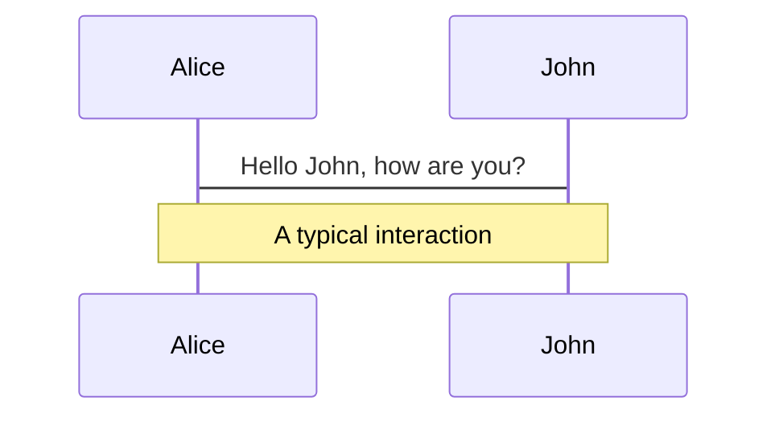
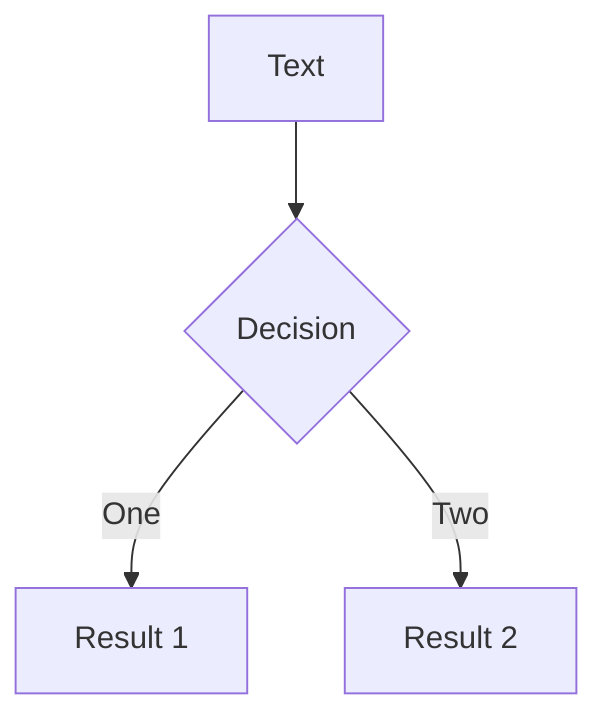

# Slidev Markdown Guide

This guide covers how to make the most out of Slidev markdown for creating presentations.

## Basics

### Slide Separators

Use `---` padded with a new line to separate slides:

```markdown
# Title

Hello, **Slidev**!

---

# Slide 2

Use code blocks for highlighting.

---

# Slide 3

Use UnoCSS classes and Vue components.
```

### Frontmatter

Each slide separated by `---` has its own frontmatter. Add frontmatter options between the `---` markers at the top of each slide.

**Styling:** `class: text-center`, `class: px-20`

**Layouts:** `layout: two-cols`, `layoutClass: gap-16`, `layout: center`, `layout: image-right`

**Importing Slides:**

Import slides from other markdown files using `src` in frontmatter:

```markdown
---
src: ./pages/imported-slides.md
hide: false
---
```

## Components & Syntax

### Components in Slides

Slidev allows you to use Vue components directly in your slides without importing them manually (thanks to unplugin-vue-components).

**Using Components:**

```markdown
# My Slide

<MyComponent :count="4"/>
```

**Component Sources:**

- Built-in components (see Built-in Components)
- Provided by themes and addons
- Custom components in the `components/` directory

**Writing Custom Components:**

Create Vue files in the `components/` directory:

```text
your-slidev/
  ├── ...
  ├── slides.md
  └── components/
      ├── ...
      └── MyComponent.vue
```

### MDC Syntax

Slidev supports optional MDC (Markdown Components) Syntax powered by markdown-it-mdc.

Enable it by adding `mdc: true` to the slide's frontmatter:

```markdown
---
mdc: true
---

This is a [red text]{style="color:red"} :inline-component{prop="value"}

{width=500px lazy}

::block-component{prop="value"}

The **default** slot

::
```

## Layouts

### Two-Column Layout

**Frontmatter:**

```markdown
---
layout: two-cols
layoutClass: gap-16
---
```

**Content:**

Use the `::right::` marker to separate left and right column content. All content before `::right::` appears in the left column, and all content after appears in the right column.

```markdown
# Left Column Title

Content for the left column goes here.

::right::

# Right Column Title

Content after the `::right::` marker goes in the right column.
```

### Grid Layouts

Use UnoCSS grid syntax for flexible layouts:

```html
<div grid="~ cols-2 gap-4">
  <div>Column 1</div>
  <div>Column 2</div>
</div>

<div grid="~ cols-4 gap-5 pt-4">
  <div>Item 1</div>
  <div>Item 2</div>
  <div>Item 3</div>
  <div>Item 4</div>
</div>
```

**Common Grid Patterns:**

- `grid="~ cols-2 gap-4"` - Two columns with gap
- `grid="~ cols-4 gap-5 pt-4"` - Four columns with gap and padding
- `grid="~ cols-2 gap-2"` - Two columns with smaller gap

## Media

### Icons

**Component:** `<carbon:arrow-right />`, `<carbon:edit />`, `<carbon:logo-github />`

**Class:** `<div class="i-carbon:arrow-up" />`

**Button:** `<button class="slidev-icon-btn" title="Action"><carbon:edit /></button>`

Carbon icons are available by default. Use `<carbon:icon-name />` for inline icons or `i-carbon:icon-name` class for icon fonts.

### Images

**Basic:** ``

**Rounded:** ``

**Positioned:** ``

**Layout via Frontmatter:**

```markdown
---
layout: image-right
image: https://cover.sli.dev
---
```

**Common Patterns:** `border="rounded"`, `class="w-80"`, `class="opacity-50"`, `class="absolute -bottom-9 -left-7"`

## Animations

### Click Animations

**v-click:**

```html
<!-- Component -->
<v-click>Hello World!</v-click>

<!-- Directive -->
<div v-click class="text-xl">Hey!</div>
```

**v-after:**

```html
<div v-click>Hello</div>
<div v-after>World</div>  <!-- Shows with previous click -->
```

**Hide after clicking:**

```html
<div v-click>Visible after 1 click</div>
<div v-click.hide>Hidden after 2 clicks</div>
<div v-after.hide>Hidden after 2 clicks</div>

<v-click>Visible after 1 click</v-click>
<v-click hide>Hidden after 2 clicks</v-click>
```

**v-clicks:**

```html
<v-clicks>
- Item 1
- Item 2
- Item 3
</v-clicks>

<v-clicks depth="2">
- Item 1
  - Item 1.1
  - Item 1.2
- Item 2
</v-clicks>

<v-clicks every="2">
- Item 1.1
- Item 1.2
- Item 2.1
- Item 2.2
</v-clicks>
```

**v-mark (Rough Notation):**

Slidev integrates Rough Notation to mark or highlight elements. The `v-mark` directive works like `v-click` and triggers after a click.

**Type:**

```html
<span v-mark.underline>Underline mark (default)</span>
<span v-mark.circle>Circle mark</span>
<span v-mark.box>Box mark</span>
<span v-mark.highlight>Highlight mark</span>
```

**Color:**

```html
<span v-mark.red>Red notation</span>
<span v-mark.orange>Orange notation</span>
<span v-mark.circle.orange="4">Circle with orange color</span>
<span v-mark="{ color: '#234' }">Custom color</span>
```

**Clicks:**

```html
<span v-mark>Triggers after click</span>
<span v-mark="5">Triggers on click 5</span>
<span v-mark="'+1'">Triggers one click after previous</span>
```

**Click Markers in Notes:**

Use `[click]` markers in presenter notes to synchronize highlighting with click animations:

```html
<!--
Content before the first click

[click] This will be highlighted after the first click

Also highlighted after the first click

- [click] This list element will be highlighted after the second click

[click:3] Last click (skip two clicks)
-->
```

Slidev divides content between click markers and highlights it in presenter notes, synchronized with slide progress.

### Click Animation Alignment

**CRITICAL:** Always ensure click animations are properly aligned. Misaligned clicks create a poor presentation experience.

**How Click Counting Works:**

Slidev counts clicks sequentially starting from 1. Each `v-click` directive increments the click counter.

- `v-click` - Appears on the next click (sequential)
- `v-after` - Appears on the same click as the previous element (doesn't increment counter)
- `v-clicks` - Automatically distributes clicks across children (N clicks for N children)
- `v-mark="N"` - Marks appear on click N (must match when element becomes visible)

**v-click Alignment:**

```html
<!-- CORRECT - Sequential clicks -->
<div v-click>Appears on click 1</div>
<div v-click>Appears on click 2</div>
<div v-click>Appears on click 3</div>

<!-- CORRECT - v-after appears with previous -->
<div v-click>Click 1</div>
<div v-after>Also click 1</div>
<div v-click>Click 2</div>
```

**v-mark Click Alignment:**

v-mark elements must have explicit click numbers that match when they become visible.

```html
<!-- CORRECT - Text always visible, marks appear on clicks -->
<span v-mark.underline="1">Underline mark</span>
<span v-mark.circle="2">Circle mark</span>
<span v-mark.box="3">Box mark</span>

<!-- INCORRECT - Wrapping v-mark in v-click creates double-click -->
<div v-click>
  <span v-mark.underline>Mark appears on click 2, not click 1</span>
</div>
```

**v-clicks Alignment:**

`v-clicks` automatically handles click distribution. Don't mix with individual `v-click` on children.

```html
<!-- CORRECT -->
<v-clicks>
  <li>Item 1 (click 1)</li>
  <li>Item 2 (click 2)</li>
  <li>Item 3 (click 3)</li>
</v-clicks>

<!-- INCORRECT -->
<v-clicks>
  <li v-click>Don't do this - breaks alignment</li>
  <li>Item 2</li>
</v-clicks>
```

**Click Counting Comments Pattern:**

Add explicit click number comments to make auditing easier:

```html
<!-- Click 1 -->
<div v-click>First item</div>

<!-- Click 2 -->
<div v-click>Second item</div>

<!-- Click 3 (appears with Click 2) -->
<div v-after>Also appears on click 2</div>

<!-- Clicks 4-7 (v-clicks handles 4 items) -->
<v-clicks>
  <li>Item 1</li>
  <li>Item 2</li>
  <li>Item 3</li>
  <li>Item 4</li>
</v-clicks>
```

**Presenter Notes Alignment:**

Presenter notes MUST align with click animations using `[click]` markers. The last comment block of each slide is treated as presenter notes:

```html
<!--
Introduction text before first click

[click] This note highlights when first v-click appears

[click] This note highlights when second v-click appears

[click] This note highlights when third v-click appears
-->

<div v-click>First content</div>
<div v-click>Second content</div>
<div v-click>Third content</div>
```

**HTML Comments and Notes:**

HTML comments can be used for slide notes. The last comment block of each slide is treated as presenter notes:

```html
<!--
The last comment block of each slide will be treated as slide notes.
It will be visible and editable in Presenter Mode along with the slide.

[click] This will be highlighted after the first click

[click] Highlighted with `count = ref(0)`

[click:3] Last click (skip two clicks)
-->
```

You can also use `<style>` tags for slide-specific CSS:

```html
<style>
h1 {
  background-color: #2B90B6;
  background-image: linear-gradient(45deg, #4EC5D4 10%, #146b8c 20%);
  -webkit-background-clip: text;
  -webkit-text-fill-color: transparent;
}
</style>
```

**Click Alignment Checklist:**

Before finalizing slides, verify:

1. Count all `v-click` directives - Each increments the counter
2. `v-after` elements - Must appear with previous click (don't increment counter)
3. `v-mark` elements - Must have explicit click numbers matching visibility
4. `v-clicks` - Don't mix with individual `v-click` on children
5. Presenter notes - Must have `[click]` markers matching each v-click
6. Click comments - Add `<!-- Click N -->` comments for complex slides
7. Test the slide - Click through and verify timing matches expectations

**Common Mistakes:**

```html
<!-- WRONG - v-mark without click numbers -->
<span v-mark.underline>Mark</span>
<span v-mark.circle>Mark</span>

<!-- WRONG - Nested v-click with v-mark -->
<div v-click>
  <span v-mark>Mark appears on click 2, not click 1</span>
</div>

<!-- WRONG - Presenter notes missing [click] markers -->
<!--
All notes highlight at once
-->
<div v-click>First</div>
<div v-click>Second</div>
```

### Motion Animations

**Basic Usage:**

```html
<div
  v-motion
  :initial="{ x: -80, opacity: 0 }"
  :enter="{ x: 0, opacity: 1 }"
  :click-3="{ x: 80 }"
  :leave="{ x: 1000 }"
>
  Content
</div>
```

**Using Variables:**

```html
<script setup lang="ts">
const final = {
  x: 0,
  y: 0,
  rotate: 0,
  scale: 1,
  transition: {
    type: 'spring',
    damping: 10,
    stiffness: 20,
    mass: 2
  }
}
</script>


```

**Properties:** `:initial`, `:enter`, `:click-N`, `:leave`

**Transition:**

```html
:enter="{ 
  x: 0, 
  opacity: 1, 
  transition: { 
    delay: 2000, 
    duration: 1000,
    type: 'spring',
    damping: 10,
    stiffness: 20
  } 
}"
```

## Code Features

### Code Snippets

**Create:**

```typescript
// #region snippet
export function reusableFunction() { /* code */ }
// #endregion snippet
```

**Import:** `<<< @/snippets/external.ts#snippet`

### Line Highlighting

Add line numbers within brackets `{}` to highlight specific lines. Line numbers start counting from 1:

```ts {2,3}
function add(
  a: Ref<number> | number,
  b: Ref<number> | number
) {
  return computed(() => unref(a) + unref(b))
}
```

**Dynamic Line Highlighting:**

Use `|` to separate stages for progressive highlighting with multiple clicks:

```ts {2-3|5|all}
function add(
  a: Ref<number> | number,
  b: Ref<number> | number
) {
  return computed(() => unref(a) + unref(b))
}
```

### Monaco Editor

Add `{monaco}` after the language id to turn a code block into a fully-featured Monaco editor:

```ts {monaco}
console.log('HelloWorld')
```

**Diff Editor:**

Use `{monaco-diff}` to create a diff editor. Use `~~~` to separate original and modified code:

```ts {monaco-diff}
console.log('Original text')

~~~

console.log('Modified text')
```

**Monaco Run:**

Use `{monaco-run}` to create an editor that can execute code directly in the slide:

```ts {monaco-run}
import { version } from 'vue'
import { emptyArray, sayHello } from './external'

sayHello()
console.log(`vue ${version}`)
console.log(emptyArray<number>(10).reduce(fib => [...fib, fib.at(-1)! + fib.at(-2)!], [1, 1]))
```

### Shiki Magic Move

Shiki Magic Move enables animations across multiple code snippets. Wrap multiple code blocks with ````md magic-move` (four backticks) to enable magic move:

````md magic-move {lines: true}
```ts {*|2|*}
// step 1
const author = reactive({
  name: 'John Doe',
  books: ['Vue 2 - Advanced Guide']
})
```

```ts {*|1-2|3-4}
// step 2
export default {
  data() {
    return {
      author: {
        name: 'John Doe',
        books: ['Vue 2 - Advanced Guide']
      }
    }
  }
}
```
````

Non-code blocks are ignored. Use line highlighting syntax `{*|2|*}` to control which lines animate.

## Advanced Features

### LaTeX

LaTeX is supported out-of-box. Powered by KaTeX.

**Inline Math:**

```markdown
Inline $\sqrt{3x-1}+(1+x)^2$
```

**Block Math:**

```markdown
$$ {1|3|all}
\begin{aligned}
\nabla \cdot \vec{E} &= \frac{\rho}{\varepsilon_0} \\
\nabla \cdot \vec{B} &= 0
\end{aligned}
$$
```

Block math can use click animations with `{1|3|all}` syntax.

### Diagrams

You can create diagrams directly in your Markdown using Mermaid or PlantUML.

**Mermaid Diagrams:**





**Mermaid Options:**

- `{scale: 0.5}` - Scale the diagram
- `{theme: 'neutral'}` - Set theme
- `{alt: 'description'}` - Alt text
