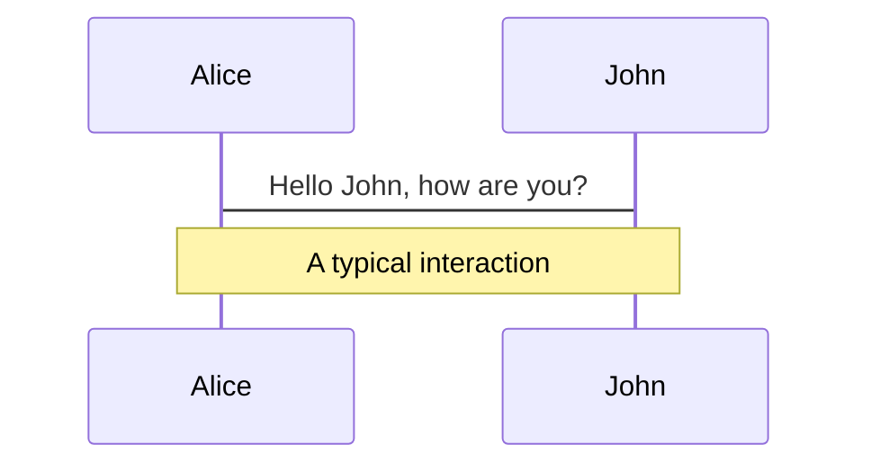
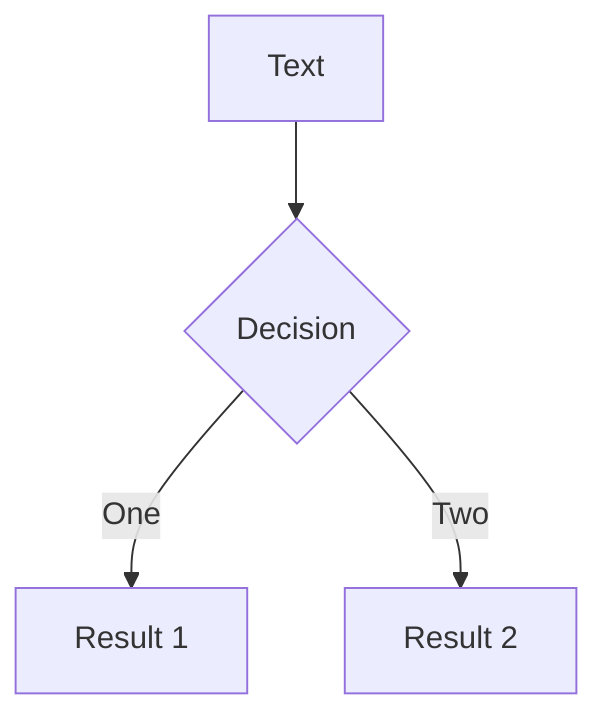

# Slidev Markdown Guide

This guide covers the basics of Slidev markdown for creating presentations. For detailed workflows, see:

- [SLIDEV_DRAFTING.md](./SLIDEV_DRAFTING.md) - Creating your first draft
- [SLIDEV_POLISHING.md](./SLIDEV_POLISHING.md) - Adding animations and polish

## Basics

### Slide Separators

Use `---` padded with a new line to separate slides:

```markdown
# Title

Hello, **Slidev**!

---

# Slide 2

Use code blocks for highlighting.

---

# Slide 3

Use UnoCSS classes and Vue components.
```

### Frontmatter

Each slide separated by `---` has its own frontmatter. Add frontmatter options between the `---` markers at the top of each slide.

**Styling:** `class: text-center`, `class: px-20`

**Layouts:** `layout: two-cols`, `layoutClass: gap-16`, `layout: center`, `layout: image-right`

**Importing Slides:**

Import slides from other markdown files using `src` in frontmatter:

```markdown
---
src: ./pages/imported-slides.md
hide: false
---
```

## Layouts

### Two-Column Layout

**Frontmatter:**

```markdown
---
layout: two-cols
layoutClass: gap-16
---
```

**Content:**

Use the `::right::` marker to separate left and right column content. **Important:** Do NOT use `::left::` markers. All content before `::right::` automatically appears in the left column, and all content after `::right::` appears in the right column.

```markdown
# Slide Title

Content for the left column goes here.
This can include multiple paragraphs, lists, etc.

::right::

# Right Column Title

Content after the `::right::` marker goes in the right column.
```

**Note:** The title can be placed before `::right::` and will span both columns or appear at the top of the slide.

### Grid Layouts

Use UnoCSS grid syntax for flexible layouts:

```html
<div grid="~ cols-2 gap-4">
  <div>Column 1</div>
  <div>Column 2</div>
</div>

<div grid="~ cols-4 gap-5 pt-4">
  <div>Item 1</div>
  <div>Item 2</div>
  <div>Item 3</div>
  <div>Item 4</div>
</div>
```

**Common Grid Patterns:**

- `grid="~ cols-2 gap-4"` - Two columns with gap
- `grid="~ cols-4 gap-5 pt-4"` - Four columns with gap and padding
- `grid="~ cols-2 gap-2"` - Two columns with smaller gap

## Media

### Icons

**Component:** `<carbon:arrow-right />`, `<carbon:edit />`, `<carbon:logo-github />`

**Class:** `<div class="i-carbon:arrow-up" />`

**Button:** `<button class="slidev-icon-btn" title="Action"><carbon:edit /></button>`

Carbon icons are available by default. Use `<carbon:icon-name />` for inline icons or `i-carbon:icon-name` class for icon fonts.

### Images

**Basic:** ``

**Rounded:** ``

**Positioned:** ``

**Layout via Frontmatter:**

```markdown
---
layout: image-right
image: https://cover.sli.dev
---
```

**Common Patterns:** `border="rounded"`, `class="w-80"`, `class="opacity-50"`, `class="absolute -bottom-9 -left-7"`

## Components

### Components in Slides

Slidev allows you to use Vue components directly in your slides without importing them manually (thanks to unplugin-vue-components).

**Using Components:**

```markdown
# My Slide

<MyComponent :count="4"/>
```

**Component Sources:**

- Built-in components (see Built-in Components)
- Provided by themes and addons
- Custom components in the `components/` directory

**Writing Custom Components:**

Create Vue files in the `components/` directory:

```text
your-slidev/
  ├── ...
  ├── slides.md
  └── components/
      ├── ...
      └── MyComponent.vue
```

### AutoFitText Component

Box inside which the font size will automatically adapt to fit the content. Similar to PowerPoint or Keynote TextBox.

**Usage:**

```html
<AutoFitText :max="200" :min="100" modelValue="Some text"/>
```

**Props:**

- `max` (string | number, default 100): Maximum font size
- `min` (string | number, default 30): Minimum font size
- `modelValue` (string, default ''): Text content

## Code

### Basic Code Blocks

Use code blocks with syntax highlighting:

```typescript
function greet(name: string) {
  return `Hello, ${name}!`
}
```

### Line Highlighting

Add line numbers within brackets `{}` to highlight specific lines:

```ts {2,3}
function add(
  a: Ref<number> | number,
  b: Ref<number> | number
) {
  return computed(() => unref(a) + unref(b))
}
```

For advanced code features like dynamic highlighting, Monaco editor, and code snippets, see [SLIDEV_POLISHING.md](./SLIDEV_POLISHING.md).

## Animations

### Basic Click Animations

**v-click:**

```html
<!-- Component -->
<v-click>Hello World!</v-click>

<!-- Directive -->
<div v-click class="text-xl">Hey!</div>
```

**v-clicks:**

```html
<v-clicks>
- Item 1
- Item 2
- Item 3
</v-clicks>
```

For detailed animation guides, click alignment, and advanced features, see [SLIDEV_POLISHING.md](./SLIDEV_POLISHING.md).

## Presenter Notes

HTML comments can be used for slide notes. The last comment block of each slide is treated as presenter notes:

```html
<!--
The last comment block of each slide will be treated as slide notes.
It will be visible and editable in Presenter Mode along with the slide.
-->
```

For syncing notes with click animations using `[click]` markers, see [SLIDEV_POLISHING.md](./SLIDEV_POLISHING.md).

## LaTeX

LaTeX is supported out-of-box. Powered by KaTeX.

**Inline Math:**

```markdown
Inline $\sqrt{3x-1}+(1+x)^2$
```

**Block Math:**

```markdown
$$
\begin{aligned}
\nabla \cdot \vec{E} &= \frac{\rho}{\varepsilon_0} \\
\nabla \cdot \vec{B} &= 0
\end{aligned}
$$
```

## Diagrams

You can create diagrams directly in your Markdown using Mermaid or PlantUML.

**Mermaid Diagrams:**





**Mermaid Options:**

- `{scale: 0.5}` - Scale the diagram
- `{theme: 'neutral'}` - Set theme
- `{alt: 'description'}` - Alt text
