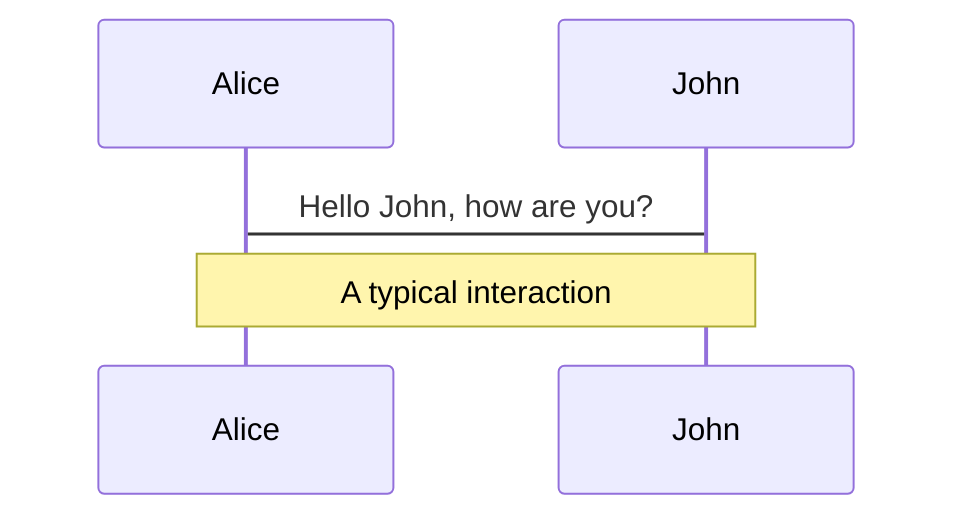
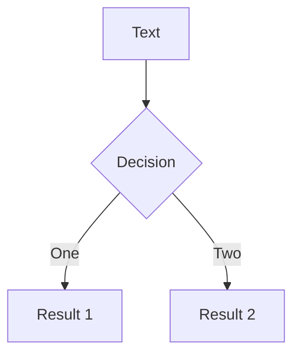

# Slidev Drafting Guide

This guide covers creating your first draft of presentation slides. Focus on **content first** - get your material and structure right before adding animations and polish.

## Workflow: Content First, Polish Later

**First Draft Approach:**
- Focus on content and structure
- Use basic layouts to organize information
- Write speaker notes as you create content
- Minimal or no click animations
- Get the material right first

**After First Draft:**
- Move to polish mode (see [SLIDEV_POLISHING.md](./SLIDEV_POLISHING.md))
- Add click animations incrementally to specific slides
- Enhance code displays only when needed
- Add visual polish selectively

Don't try to one-shot everything - build the content first, then enhance specific slides that benefit from animation.

## Slide Basics

### Slide Separators

Use `---` padded with a new line to separate slides:

```markdown
# Title

Hello, **Slidev**!

---

# Slide 2

Use code blocks for highlighting.

---

# Slide 3

Use UnoCSS classes and Vue components.
```

### Frontmatter

Each slide separated by `---` has its own frontmatter. Add frontmatter options between the `---` markers at the top of each slide.

**Basic Frontmatter Options:**

- **Styling:** `class: text-center`, `class: px-20`
- **Layouts:** `layout: two-cols`, `layoutClass: gap-16`, `layout: center`, `layout: image-right`
- **Theme:** `theme: seriph` (set in first slide)
- **Background:** `background: https://cover.sli.dev`
- **Title:** `title: My Presentation`

**Importing Slides:**

Import slides from other markdown files using `src` in frontmatter:

```markdown
---
src: ./pages/imported-slides.md
hide: false
---
```

## Layouts

Layouts help organize your content. Use them to structure information effectively.

### Two-Column Layout

Use `layout: two-cols` to split content into two columns:

**Frontmatter:**

```markdown
---
layout: two-cols
layoutClass: gap-16
---
```

**Content:**

Use the `::right::` marker to separate left and right column content. **Important:** Do NOT use `::left::` markers. All content before `::right::` automatically appears in the left column, and all content after `::right::` appears in the right column.

```markdown
# Slide Title

Content for the left column goes here.
This can include multiple paragraphs, lists, etc.

::right::

# Right Column Title

Content after the `::right::` marker goes in the right column.
```

**Common Mistakes to Avoid:**

- ❌ Don't use `::left::` - it's not needed and will break the layout
- ✅ Just put content before `::right::` for the left column
- ✅ The title can be before `::right::` and will span both columns or appear at the top

### Center Layout

Use `layout: center` for centered content:

```markdown
---
layout: center
class: text-center
---

# Centered Title

Content appears centered on the slide.
```

### Image Layouts

Use image layouts to position images automatically:

```markdown
---
layout: image-right
image: https://cover.sli.dev
---

# Image Layout

The image appears automatically on the right side.
```

Other options: `layout: image-left` or `layout: image` for centered images.

### Grid Layouts

Use UnoCSS grid syntax for flexible column layouts:

```html
<div grid="~ cols-2 gap-4">
  <div>Column 1</div>
  <div>Column 2</div>
</div>

<div grid="~ cols-4 gap-5 pt-4">
  <div>Item 1</div>
  <div>Item 2</div>
  <div>Item 3</div>
  <div>Item 4</div>
</div>
```

**Common Grid Patterns:**

- `grid="~ cols-2 gap-4"` - Two columns with gap
- `grid="~ cols-4 gap-5 pt-4"` - Four columns with gap and padding
- `grid="~ cols-2 gap-2"` - Two columns with smaller gap

## Media

### Icons

Carbon icons are available by default. Use them in your slides:

**Component syntax:**

```html
<carbon:arrow-right /> <carbon:edit /> <carbon:logo-github />
```

**Class syntax:**

```html
<span class="i-carbon:arrow-up" />
```

**Button syntax:**

```html
<button class="slidev-icon-btn" title="Action"><carbon:edit /></button>
```

### Images

Add images to your slides:

**Basic:**

```html

```

**Rounded:**

```html

```

**Positioned:**

```html

```

**Common Patterns:**

- `border="rounded"` - Rounded corners
- `class="w-80"` - Set width
- `class="opacity-50"` - Set opacity
- `class="absolute -bottom-9 -left-7"` - Position absolutely

## Code

### Basic Code Blocks

Use code blocks with syntax highlighting:

```typescript
function greet(name: string) {
  return `Hello, ${name}!`
}
```

Just use standard markdown code blocks with language tags. No line highlighting or advanced features needed for first draft.

## Components

### Using Components

Slidev allows you to use Vue components directly in your slides without importing them manually.

**Using Components:**

```markdown
# My Slide

<MyComponent :count="4"/>
```

**Component Sources:**

- Built-in components (see Built-in Components)
- Provided by themes and addons
- Custom components in the `components/` directory

### Writing Custom Components

Create Vue files in the `components/` directory:

```text
your-slidev/
  ├── ...
  ├── slides.md
  └── components/
      ├── ...
      └── MyComponent.vue
```

Components are automatically available in all slides without manual imports.

## Speaker Notes

Write speaker notes as HTML comments. The last comment block of each slide is treated as presenter notes:

```html
<!--
This is your speaker note. It will be visible in Presenter Mode
but not shown on the main screen.

You can write your talking points here, reminders, or anything
else that helps you present.

For first draft, just write basic notes. Don't worry about
[click] markers yet - add those later in polish mode when
you add click animations.
-->
```

**Key Points:**

- Write notes as you create content
- Use HTML comments (`<!-- -->`)
- Last comment block becomes presenter notes
- Keep notes simple for first draft
- Add `[click]` markers later in polish mode (see [SLIDEV_POLISHING.md](./SLIDEV_POLISHING.md))

## Content Features

### LaTeX Math

If your content needs mathematical equations, LaTeX is supported:

**Inline Math:**

```markdown
Inline $\sqrt{3x-1}+(1+x)^2$
```

**Block Math:**

```markdown
$$
E = mc^2
$$
```

LaTeX is powered by KaTeX and works out-of-the-box.

### Diagrams

If your content needs diagrams, you can create them directly in Markdown:

**Mermaid Diagrams:**





**Mermaid Options:**

- `{scale: 0.5}` - Scale the diagram
- `{theme: 'neutral'}` - Set theme
- `{alt: 'description'}` - Alt text

Use diagrams when they help explain your content, but don't overcomplicate things in the first draft.

## Next Steps

Once you have your content and structure in place:

1. Review your slides for flow and completeness
2. Identify slides that would benefit from animations
3. Move to [SLIDEV_POLISHING.md](./SLIDEV_POLISHING.md) to add:
   - Click animations to specific slides
   - Advanced code highlighting
   - Visual enhancements
   - Synchronized presenter notes with `[click]` markers

Remember: Content first, polish later. Get the material right, then enhance incrementally.

