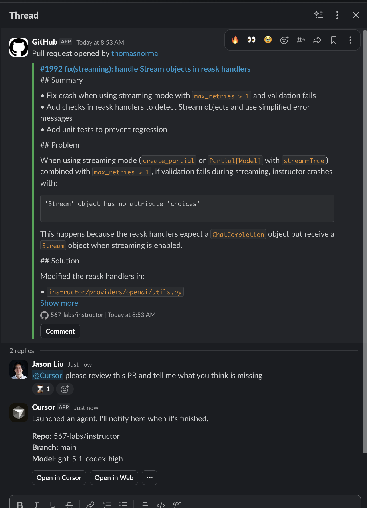
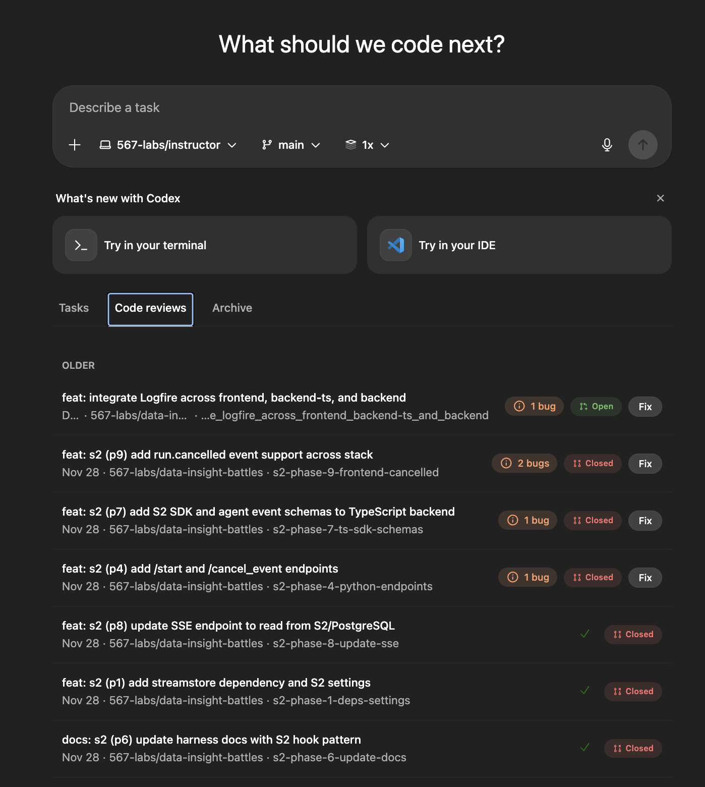
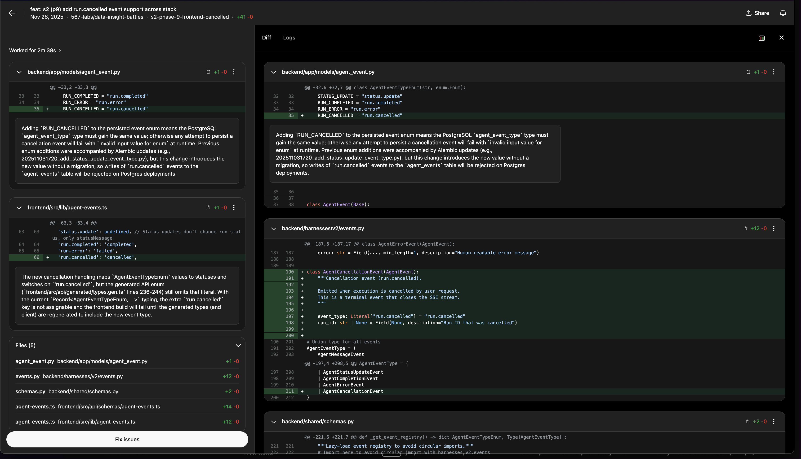

# Async Agents 101

Background Agents & Async Workflows

<!--
Welcome back. This is the afternoon session.

This morning we covered synchronous workflows - AGENTS.md, custom commands, planning patterns, testing infrastructure. Those are the foundation.

This afternoon we build on that foundation. We're talking about async workflows - kicking off agents and walking away. Work that happens in parallel with your life, not blocking it.
-->

---

# What We'll Cover

1. **Why Async:** The multiplication effect
2. **Where to Trigger:** Cursor, GitHub, Slack, Linear, Codex
3. **Foundations for Trust:** AGENTS.md, testing, security
4. **Parallel Execution:** Running multiple agents simultaneously
5. **Workflow Patterns:** Delegation philosophy and when to go async
6. **Team Adoption:** Scaling across your organization

<!--
Six parts this afternoon.

Why async matters - the multiplication effect.

Where to trigger async agents - all the platforms and entry points.

Foundations for trust - what makes async delegation reliable.

Parallel execution - running multiple agents at once.

Workflow patterns - delegation philosophy.

Team adoption - how to scale this.
-->

---
layout: section
---

# Part 1: Why Async?

The Multiplication Effect

<!--
Let's start with why async workflows matter.
-->

---

# The Multiplication Effect

**Async workflows unlock work that would otherwise never happen.**

Every codebase has a backlog of small improvements that never get prioritized:
- Documentation updates
- Minor bug fixes
- Logging consistency
- Code cleanup

Humans deprioritize these because the context-switching cost is too high.

<!--
Every codebase has this backlog. Small improvements that never make it into a sprint. Documentation that's slightly outdated. Minor bugs. Logging that's inconsistent.

Humans deprioritize these because by the time you load the relevant files, understand the change, make it, and test it - you've lost 20 minutes on something that "wasn't worth it."

Agents eliminate that cost. They context-switch instantly between ten different small tasks.
-->

---

# Work Continues Without You

**The shift: from "is this worth my time?" to "is this worth kicking off?"**

- Kick off a task from your phone before bed, wake up to a full implementation
- Start an agent before your 10am standup, review the PR over lunch
- Tag an issue during a meeting, merge the fix before end of day

The work happens in parallel with your life, not blocking it.

<!--
The question shifts from "is this worth my time?" to "is this worth kicking off?" And the answer is almost always yes.

Kick off a task before bed, wake up to a full implementation. Start an agent before standup, review the PR over lunch. Tag an issue during a meeting, merge the fix before end of day.

The work happens in parallel with your life.
-->

---

# Small Wins Compound

**Building confidence through momentum:**

- Each small fix can be reviewed and merged quickly
- Builds your confidence in the agent's capabilities
- Creates momentum that compounds into larger delegations
- Ten 50-line PRs compound into significant progress over a week

<!--
Small wins add up. Each small fix can be reviewed and merged quickly. This builds your confidence in what agents can handle.

Over time, that confidence compounds. You start trusting agents with larger tasks. Ten 50-line PRs compound into significant progress.
-->

---
layout: section
---

# Part 2: Where to Trigger Async Agents

Cursor, GitHub, Slack, Linear, Codex

<!--
Part 2 covers all the places you can kick off async agents - every platform and entry point.
-->

---

# Three Kickoff Patterns

| Pattern | Best For | Planning Overhead |
|---------|----------|-------------------|
| **Cursor Plan Mode** | Complex features, architectural changes | High - but worth it |
| **GitHub Mentions** | Isolated fixes, PR feedback, test fixes | Low |
| **Slack** | Quick fixes, docs, small improvements | Minimal |

**The key insight:** Match your kickoff method to the complexity of the task.

<!--
Three main patterns for kicking off async work.

Cursor Plan Mode for complex features - iterate on the plan first, then kick off.

GitHub mentions for isolated fixes - tag an agent on an issue or PR.

Slack for quick fixes - conversational delegation.

The key is matching the method to task complexity.
-->

---

# Cursor: Plan Mode to Background Agent

**The most structured approach for complex features:**

1. Enter Plan Mode in Cursor
2. Iterate on the plan until you're satisfied
3. Review, ask clarifying questions, refine scope
4. Kick off the background agent with the detailed plan
5. Agent executes independently while you work on something else

Use this when you need to think through the implementation approach before letting the agent run.

<!--
Cursor Plan Mode is the most structured approach.

Enter plan mode, iterate on the plan with the agent. Ask questions, refine scope. Once you're satisfied, kick off the background agent.

The agent executes independently while you work on something else. This pattern works well when you need to think through the implementation, identify edge cases, or coordinate with existing code patterns.
-->

---

# Cursor: Automatic CI Fixing

**Cursor's Cloud Agents automatically attempt to fix CI failures in PRs they create.**

- Ignores failures that also fail on the base commit (pre-existing issues)
- Currently supports GitHub Actions
- Disable globally: Cursor Dashboard > Cloud Agents > My Settings
- Disable per-PR: comment `@cursor autofix off`

**For your own PRs:** Tag Cursor in a comment:
- `@cursor please fix the CI failures`
- `@cursor fix the lint check failure`

<!--
Cursor's cloud agents don't just create PRs - they monitor CI and fix failures automatically. They're smart enough to ignore pre-existing failures.

You can disable this globally or per-PR if needed. And you can ask Cursor to fix CI in your own PRs by tagging them in comments.
-->

---

# GitHub: @-Mentions on Issues and PRs

**For small, well-defined changes:**

- **On Issues:** `@cursor implement this feature` or `@codex fix this bug`
- **On Pull Requests:** `@codex please address the review feedback`
- **On failing CI:** `@cursor fix the lint errors`
- **Update context:** `@cursor fix this and update AGENTS.md with what you learned`

Works from your phone - respond to notifications while on the go.

<!--
GitHub mentions work for small, well-defined changes.

Comment @cursor or @codex on an issue and it picks up the work. Mention them on a PR to make adjustments or fix failing tests.

Pro tip: when an agent misses something, tell it to fix the issue AND update AGENTS.md with what it learned. This improves future runs.

I often respond to GitHub notifications from my phone - tag an agent while waiting in line.
-->

---

# Slack: Conversational Delegation

**The most casual approach:**

- Tag an agent in any channel with a request
- Agent picks up the task from conversation context
- Trigger workspace skills/commands from Slack
- Works from your phone - kick off work while commuting

<!--
Slack is the most casual approach.

Tag an agent in any channel. The agent picks up the task from the conversation context. You review results via Slack notifications - often with screenshots.

If you've set up local skills or custom commands in your repo, agents can trigger those from Slack too.

I often kick off work from my phone - waiting for coffee, on the train. By the time I'm at my desk, there's a PR to review.
-->

---

# Slack: Devin's Release Workflow

**"Devin, please do a release" triggers a multi-step workflow:**

1. Reviews QA results
2. Determines bug ownership using git history
3. Tags responsible engineers in Slack
4. Sends reminders if issues remain unaddressed

**Why this works:** The release process follows a predictable pattern but involves multiple steps. Human kicks it off with a single message and walks away.

<!--
Case study from Cognition - the company behind Devin.

When someone types "Devin, please do a release" in Slack, it triggers a full workflow. Reviews QA results, looks up git blame to find who caused issues, tags the right engineers in Slack, sends reminders.

The human kicks it off with one message and walks away. Devin handles the coordination work that would otherwise require checking multiple systems and sending manual messages.
-->

---

# Linear: AI-Native Command Center

**Linear evolved into an AI-native command center:**

- Assign Linear issues directly to coding agents
- Agents work in background sessions while you focus elsewhere
- Agents are first-class citizens: mentionable, assignable, with activity streams
- Workspace-level prompt guidance fed to all agents

**Two approaches:**
1. Linear as orchestrator - managing everything
2. Linear as source of truth - pull context into Cursor as needed

<!--
Linear has become an AI-native command center.

You can assign issues directly to coding agents. Agents work in background sessions. They're first-class citizens - you can mention them, assign work to them, see their activity.

Two approaches: Linear as the orchestrator managing everything, or Linear as source of truth where you pull context into Cursor. Most teams start with the second approach.
-->

---

# Linear: The `/make-linear-ticket` Command

**Capture issues without context switching:**

When you spot an issue while coding, type the command and keep going.

The command:
- Grabs current context (file, recent changes, error messages)
- Auto-routes to right project based on file path
- Includes code snippets automatically
- Tags right agents for async execution

**Example:** Working on frontend, notice backend API issue, type `/make-linear-ticket "API returning inconsistent date formats"` and keep coding.

<!--
Create a command for making Linear tickets.

When you spot an issue while coding, type the command and keep going. It grabs your current context - file, recent changes, error messages. Auto-routes to the right project. Tags the right agents.

By lunch, there's a PR fixing the issue you spotted. You never had to context switch.
-->

---

# Codex: Multi-Interface Access

**One agent, many interfaces:**

- CLI / VS Code / Cursor extensions
- Browser (chatgpt.com/codex)
- GitHub mentions
- Slack integration
- **iOS app** - kick off from your phone

**Same agent everywhere.** Start on phone, check on laptop, review via Slack.

<!--
Codex operates as a single unified agent across multiple interfaces.

CLI, VS Code extensions, browser, GitHub mentions, Slack, iOS app. Same agent everywhere.

I use the iOS app constantly - kick off a task while waiting for coffee, review the PR when I get to my desk.
-->

---

# Codex: Code Reviews

**One-click fixes from the code review tab:**

- Codex analyzes PRs and identifies potential bugs
- Click "Fix issues" to launch an agent that addresses them
- Agent reads the diff, understands context, and creates fixes

<!--
The code review tab shows PRs with identified issues. Click "Fix issues" and Codex launches an agent to address them automatically. You review the fix, not the bug.
-->

---
layout: section
---

# Part 3: Foundations for Trust

Building Confidence in Async Agents

<!--
Part 3 covers what makes async delegation trustworthy - the foundations that let you kick off agents and walk away with confidence.
-->

---

# Building Confidence Through AGENTS.md

**This morning's foundation pays off here.**

Each time an agent misunderstands something about your codebase, add a clarifying rule to AGENTS.md.

**The confidence progression:**
1. Start with small, well-defined tasks where failure is low-cost
2. Review agent output carefully, noting where it misunderstands patterns
3. Update AGENTS.md with corrections
4. Gradually increase task complexity as success rate improves
5. Eventually trust agents with multi-file changes and feature work

<!--
This is where this morning's foundation pays off.

Each time an agent misunderstands something, add a clarifying rule to AGENTS.md. Over weeks and months, your agent context becomes rich enough that you can trust background agents with increasingly complex tasks.

Start with small tasks. Review carefully. Update AGENTS.md. Gradually increase complexity. The agent's understanding improves with every correction you make.
-->

---

# Testing Infrastructure as the Foundation

**All async agent work depends on verification.**

- Unit tests catch obvious regressions
- API tests against real endpoints catch integration issues
- Preview deployments let agents see what users will see
- CI that agents can read and respond to

The better your verification infrastructure, the more you can trust async agents.

<!--
All of this async work depends on your testing infrastructure.

Unit tests catch regressions. API tests catch integration issues. Preview deployments let agents see what users will see.

We covered testing setup this morning. That foundation is what makes async delegation possible. The better your verification infrastructure, the more you can trust async agents.
-->

---

# Infrastructure Enables Autonomy

**Cloud agent environments are Docker containers that run `git pull` first.**

This speaks to the importance of setting up all that infrastructure:

- Environment configs that mount the right API keys
- Pre-commit hooks installed and working
- Tests separated into fast/slow/local categories
- Scoped credentials for staging vs production

**The morning's foundation work enables afternoon's autonomy.** The more your repo can self-verify, the more you can trust async agents.

<!--
Cloud agents run in Docker containers - they pull your repo and run. Everything we covered this morning about infrastructure setup directly enables async autonomy.

Environment configs with the right API keys. Pre-commit hooks that catch issues. Tests split so fast ones run locally. This all compounds into agents that can run longer without human intervention.

The better your infrastructure, the more autonomous your agents can be.
-->

---
layout: section
---

# Part 4: Parallel Execution

Running Multiple Agents

<!--
Part 4 is about parallel execution. Running multiple agents simultaneously to maximize throughput.
-->

---

# Parallel Session Management

**Boris's approach - maximize throughput:**

- Run 5 terminal sessions in parallel (numbered tabs 1-5)
- Run 5-10 web sessions at claude.ai/code simultaneously
- Use system notifications to know when agent needs input
- Hand off sessions between terminal and web using `&` operator

Sessions continue processing while you switch between them.

<!--
Boris runs 5 terminal sessions and 5-10 web sessions in parallel.

System notifications tell him when an agent needs input. Sessions continue processing while he switches between them.

This maximizes throughput. Multiple agents working on different tasks simultaneously.
-->

---

# Cloud Tasks and Background Processing

**Cloud tasks run in isolated containers:**

- Common toolchains pre-installed (Python, Node.js, npm, pnpm, pip)
- Sandboxing prevents agents from breaking out of project boundaries
- Can run multiple instances of same task with different approaches
- No conflict risk between parallel tasks

**Computer Use Mode:** Embedded browser for visual debugging. Can execute 20+ minute testing workflows.

<!--
Cloud tasks run in isolated containers. Common toolchains are pre-installed. Sandboxing prevents agents from breaking boundaries.

You can run multiple instances of the same task with different approaches. No conflict risk between parallel tasks.

Computer use mode gives agents an embedded browser - they can execute 20+ minute testing workflows, filling out forms and monitoring results.
-->

---

# A/B Testing Implementations

**Run multiple versions of the same task in parallel:**

1. Kick off 4 parallel versions of the same task
2. Review generated screenshots to compare implementations
3. Choose preferred version
4. Request refinements
5. Kick off 4 more variations from the chosen version
6. Continue parallel exploration until satisfied

Screenshots are auto-generated for visual comparison.

<!--
A/B testing implementations. Kick off 4 parallel versions of the same task. Review screenshots to compare. Choose the best one. Request refinements. Kick off more variations.

This is parallel exploration. Instead of iterating sequentially, you explore the solution space in parallel.

Screenshots are auto-generated so you can visually compare implementations.
-->

---

# Repository Structure for Parallel Work

**Structure your repo to enable parallel agent work:**

**Naming:**
- Use unique project codenames that don't appear elsewhere (e.g., "wam")
- Enables effective ripgrep for fast navigation

**Folder Structure:**
- Multiple example folders allow parallel work without conflicts
- Can kick off 3 tasks updating different folders simultaneously

**Dependency Management:**
- Use pnpm workspaces with separate package.json files
- Code duplication more acceptable when AI manages overhead

<!--
Structure matters for parallel work.

Use unique project codenames - enables effective ripgrep. Multiple example folders let agents work in parallel without conflicts.

Use pnpm workspaces with separate package.json files. Code duplication is more acceptable when AI manages the overhead.

This is the same file organization we discussed this morning, now paying dividends for parallel execution.
-->

---
layout: section
---

# Part 5: Workflow Patterns

Delegation and Timing

<!--
Part 5 covers workflow patterns. When to go async and how to delegate effectively.
-->

---

# Real-Time Feedback Workflow

**Keep agent UI open during feedback meetings:**

- Have ChatGPT open while stakeholders review your website
- As people give feedback, drop each piece as a message to the agent
- Agent works on fixes in the background while meeting continues
- By end of meeting, you may have PRs ready

**Works well for:** Panel ordering, copywriting, small UI adjustments, bug fixes.

<!--
Powerful pattern: keep the agent UI open during feedback meetings.

Stakeholders review your website, give feedback. You drop each piece of feedback as a message to the agent. Agent works on fixes while the meeting continues.

By the end of the meeting, you may have PRs ready. Works great for panel ordering, copywriting, small UI tweaks.
-->

---

# Delegation Philosophy

**Treat agents as senior engineers, not tools requiring supervision.**

- Give 1-2 sentence instructions and let the agent run
- Talk to agents like senior engineers
- Kick off tasks immediately when thought of, not when time available
- Avoid babysitting - if watching code being written, you're using it wrong
- Interrupt and steer if needed, but trust independent execution

<!--
The core philosophy: delegate like a tech lead.

Give 1-2 sentence instructions. Kick off immediately when you think of it. Don't babysit - if you're watching code being written, you're using it wrong.

Trust independent execution. Interrupt and steer if needed, but let them run.
-->

---

# Sync vs Async Framework

| Mode | Duration | Attention | Use Case |
|------|----------|-----------|----------|
| **Synchronous** | 20 seconds to 1 minute | Full attention | Quick questions, small edits |
| **Asynchronous** | Minutes to hours | Delegated | Full features, complex tasks |
| **Danger Zone** | 5-10 minutes | Semi-attentive | Avoid this range |

<Callout type="warning">
Avoid the "semi-async danger zone" of 5-10 minute waits that break focus.
</Callout>

Either go fast (under 20 seconds) or fully async.

<!--
Understanding when to use each mode.

Synchronous: 20 seconds to 1 minute, full attention. Quick questions, small edits.

Asynchronous: minutes to hours, fully delegated. Full features, complex tasks.

Danger zone: 5-10 minutes of semi-attentive waiting. This breaks your focus without letting you do other work. Avoid this range.

Either go fast or go fully async.
-->

---

# Recommended Cycle: Plan, Code, Test

**Structure your day around this continuous cycle:**

1. **Synchronous planning:** Use fast IDE tools to understand codebase, create task specs
2. **Asynchronous coding:** Delegate implementation to agents working independently
3. **Synchronous testing:** Test and refine agent's changes using IDE tools
4. **Continuous cycle:** While one agent codes, you're planning next task

<!--
Structure your day around this cycle.

Synchronous planning - use fast IDE tools to understand and spec the task. Asynchronous coding - delegate and let agents work. Synchronous testing - review and refine.

While one agent codes, you're planning the next task and testing completed work. Continuous cycle.
-->

---

# Background Task Patterns

**Start small and build confidence:**

1. Start with 200-line PRs
2. Learn how explicit you need to be
3. Recognize patterns
4. Scale up: 200-line PRs become 400-line, then 800-line PRs
5. Treat agents as team members

**High-value patterns:**
- Have a small idea? Kick it off before standup
- Notice a bug while reviewing? Tag agent and grab coffee
- **Multiplication effect:** Code that would never be written because it wasn't worth the context switch

<!--
Start small. 200-line PRs. Learn how explicit your instructions need to be. Recognize patterns. Scale up.

High-value patterns: kick off ideas before standup. Notice a bug while reviewing? Tag an agent and grab coffee.

The multiplication effect: code that would never be written because it wasn't worth the context switch. That's what async unlocks.
-->

---
layout: section
---

# Part 6: Team Adoption

Scaling Async Workflows

<!--
Part 6 covers team adoption. How to scale async workflows across your organization.
-->

---

# The AI Champion Role

**If you're the AI champion, prioritize setting up integrations:**

- Work with IT to approve GitHub apps (Cursor, Codex)
- Get Slack workspace permissions for agent bots
- Configure Linear/Jira integrations for your repos
- Set up the secrets and environment variables agents need
- Document which repos have which integrations enabled

**These integrations require admin permissions.** Someone needs to own this.

<!--
This morning's session covered AGENTS.md and repo-level setup. This afternoon's async workflows require integration setup.

If you're the AI champion, work with IT to get the GitHub apps approved, Slack permissions configured, and secrets set up. This is the foundation that enables everyone else to use async agents.

Without these integrations, your team can't use @cursor in GitHub or Slack. Someone has to own this setup work.
-->

---

# Team Workflow Patterns

**Linear team's internal adoption:**
- Uses Slack agent extensively
- Project-specific channels where team members drop feedback/bugs
- Agent quickly files issues from channel discussions

**Jason's PR workflow:**
- Uses Cursor to create Linear tickets for separate concerns during PR work
- Assigns agents to those tickets
- Merges them independently, then merges back to main PR
- Keeps PRs focused and organized

<!--
How teams are adopting this.

The Linear team uses Slack agents extensively. Project-specific channels where people drop feedback. Agent files issues from the discussion.

My workflow: during PR work, create Linear tickets for separate concerns, assign agents to those tickets, merge independently, then merge back to main PR. Keeps PRs focused.
-->

---

# Scaling Without Chaos

**Define guardrails:**
- Define allowed task categories (docs, linting, logging consistency, small fixes)
- Require evidence: agents attach logs/screenshots to tickets or PRs
- Set success metrics (time saved, PR size, rework rate)

**Building trust:**
- Start with 1-2 background tasks per day
- Build habit first
- Build trust before delegating complex features

<!--
Scaling without chaos requires guardrails.

Define allowed task categories. Require evidence - agents should attach logs and screenshots. Set success metrics.

Build trust gradually. Start with 1-2 background tasks per day. Build the habit. Build trust before delegating complex features.
-->

---

# Quality Improvements at Scale

**The multiplication effect at team scale:**

- Background agents handle the backlog that never makes it into sprints
- Codebase gets cleaner without pulling engineers off features
- Quality work happens in parallel with feature development
- Compound improvements over weeks and months

**The question becomes: what would you fix if fixing it cost nothing?**

<!--
This is the multiplication effect at team scale.

Background agents handle the quality backlog that never makes it into sprints. The codebase gets cleaner without anyone being pulled off features.

Ask your team: what would you fix if fixing it cost nothing? That's your agent backlog.
-->

---
layout: section
---

# Wrap-up

<!--
Let's wrap up.
-->

---

# Key Takeaways

**Today:**
- Try one async delegation: tag an agent on an issue or in Slack
- Let it run while you do something else

**This Week:**
- Set up Codex or Cursor cloud agents
- Create a `/make-linear-ticket` command
- Kick off 2-3 background tasks per day

**This Month:**
- Build the habit of async delegation
- Scale to parallel execution
- Trust agents with larger features

<!--
Quick wins.

Today: try one async delegation. Tag an agent on an issue or in Slack. Let it run while you do something else.

This week: set up Codex or Cursor cloud agents. Create a make-linear-ticket command. Kick off 2-3 background tasks per day.

This month: build the habit. Scale to parallel execution. Trust agents with larger features.
-->

---

# Setup Time

**This session is shorter, giving you time to set up async tooling.**

**Codex Setup:**
1. Go to chatgpt.com/codex
2. Install GitHub App: github.com/apps/chatgpt-codex-connector
3. Add environment secrets if needed

**Cursor Cloud Agents:**
1. Install GitHub App: cursor.com/docs/integrations/github
2. Go to cursor.com/agents or cursor.com/docs/cloud-agent
3. Configure environment via `Cmd+Shift+P` > "Cursor: Start Cloud Agent Setup"

**Slack Integration:**
- Codex: Install from Codex settings
- Cursor: cursor.com/docs/integrations/slack

<!--
Use the remaining time to set up async tooling.

Codex: go to chatgpt.com/codex, install the GitHub app at github.com/apps/chatgpt-codex-connector, add secrets.

Cursor cloud agents: install GitHub app at github.com/apps/cursor, then cursor.com/agents to start.

Slack integration: install from settings.

Documentation links are on the next slide.
-->

---
layout: center
---

# Questions?

**Resources:**
- Codex: chatgpt.com/codex
- Codex GitHub App: github.com/apps/chatgpt-codex-connector
- Cursor Cloud Agents: cursor.com/docs/cloud-agent
- Cursor GitHub: cursor.com/docs/integrations/github

<!--
Questions?

Resources are listed here. Codex, Cursor cloud agents, Slack integrations.

Use the remaining time to set up your async tooling. We're here to help if you run into issues.
-->
