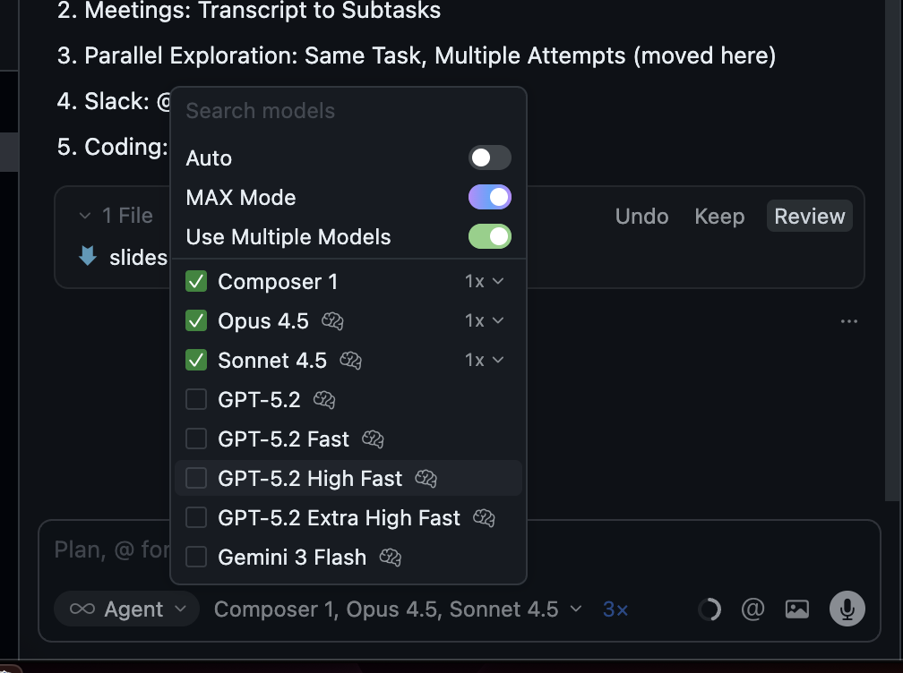

# Async Agents 101

Background Agents & Async Workflows

<!--
Welcome back. This is the afternoon session.

This morning we covered synchronous workflows - AGENTS.md, custom commands, planning patterns, testing infrastructure. Those are the foundation.

This afternoon we build on that foundation. We're talking about async workflows - kicking off agents and walking away. Work that happens in parallel with your life, not blocking it.
-->

---

# What We'll Cover

1. **Why Async:** The multiplication effect
2. **Where to Trigger:** Cursor, GitHub, Slack, Linear, Codex
3. **Foundations for Trust:** Building on sync foundations
4. **Team Adoption**

<!--
Four parts this afternoon.

Why async matters - the multiplication effect.

Where to trigger async agents - all the platforms and entry points.

Foundations for trust - what makes async delegation reliable.

Team adoption - how to scale this.
-->

---
layout: section
---

## Have you used background agents before? (yes/no + what for?)

---
layout: section
---

# Part 1: Why Async?

The Multiplication Effect

<!--
Let's start with why async workflows matter.
-->

---

# The Multiplication Effect

**Async workflows unlock work that would otherwise never happen.**

Every codebase has a backlog of small improvements that never get prioritized:
- Documentation updates
- Minor bug fixes
- Logging consistency
- Code cleanup

Humans deprioritize these because the context-switching cost is too high.

<!--
Every codebase has this backlog. Small improvements that never make it into a sprint. Documentation that's slightly outdated. Minor bugs. Logging that's inconsistent.

Humans deprioritize these because by the time you load the relevant files, understand the change, make it, and test it - you've lost 20 minutes on something that "wasn't worth it."

Agents eliminate that cost. They context-switch instantly between ten different small tasks.
-->

---
layout: section
---

## What's one small fix you've been putting off that you'd love to delegate?

---

# Work Continues Without You

**The shift: from "is this worth my time?" to "is this worth kicking off?"**

- Kick off a task from your phone before bed, wake up to a full implementation
- Start an agent before your 10am standup, review the PR over lunch
- Tag an issue during a meeting, merge the fix before end of day

The work happens in parallel with your life, not blocking it.

<!--
The question shifts from "is this worth my time?" to "is this worth kicking off?" And the answer is almost always yes.

Kick off a task before bed, wake up to a full implementation. Start an agent before standup, review the PR over lunch. Tag an issue during a meeting, merge the fix before end of day.

The work happens in parallel with your life.
-->

---
layout: section
---

## When is your best kickoff window? (before standup / lunch / after meetings / before bed / commute)

---

# Small Wins Compound

**Building confidence through momentum:**

- Each small fix can be reviewed and merged quickly
- Builds your confidence in the agent's capabilities
- Creates momentum that compounds into larger delegations
- Ten 50-line PRs compound into significant progress over a week

<!--
Small wins add up. Each small fix can be reviewed and merged quickly. This builds your confidence in what agents can handle.

Over time, that confidence compounds. You start trusting agents with larger tasks. Ten 50-line PRs compound into significant progress.
-->

---
layout: section
---

# Part 2: Where to Trigger Async Agents

Cursor, GitHub, Slack, Linear, Codex

<!--
Part 2 covers all the places you can kick off async agents - every platform and entry point.
-->

---

# Three Kickoff Patterns

| Pattern | Best For | Planning Overhead |
|---------|----------|-------------------|
| **Cursor Plan Mode** | Complex features, architectural changes | High - but worth it |
| **GitHub Mentions** | Isolated fixes, PR feedback, test fixes | Low |
| **Slack** | Quick fixes, docs, small improvements | Minimal |

**The key insight:** Match your kickoff method to the complexity of the task.

<!--
Three main patterns for kicking off async work.

Cursor Plan Mode for complex features - iterate on the plan first, then kick off.

GitHub mentions for isolated fixes - tag an agent on an issue or PR.

Slack for quick fixes - conversational delegation.

The key is matching the method to task complexity.
-->

---

# Cursor: Plan Mode to Background Agent

**The most structured approach for complex features:**

1. Enter Plan Mode in Cursor
2. Iterate on the plan until you're satisfied
3. Review, ask clarifying questions, refine scope
4. Kick off the background agent with the detailed plan
5. Agent executes independently while you work on something else

Use this when you need to think through the implementation approach before letting the agent run.

<!--
Cursor Plan Mode is the most structured approach.

Enter plan mode, iterate on the plan with the agent. Ask questions, refine scope. Once you're satisfied, kick off the background agent.

The agent executes independently while you work on something else. This pattern works well when you need to think through the implementation, identify edge cases, or coordinate with existing code patterns.
-->

---

# Cursor: Automatic CI Fixing

**Cursor's Cloud Agents automatically attempt to fix CI failures in PRs they create.**

- Ignores failures that also fail on the base commit (pre-existing issues)
- Currently supports GitHub Actions
- Disable globally: Cursor Dashboard > Cloud Agents > My Settings
- Disable per-PR: comment `@cursor autofix off`

**For your own PRs:** Tag Cursor in a comment:
- `@cursor please fix the CI failures`
- `@cursor fix the lint check failure`

<!--
Cursor's cloud agents don't just create PRs - they monitor CI and fix failures automatically. They're smart enough to ignore pre-existing failures.

You can disable this globally or per-PR if needed. And you can ask Cursor to fix CI in your own PRs by tagging them in comments.
-->

---

# GitHub: @-Mentions on Issues and PRs

**For small, well-defined changes:**

- **On Issues:** `@cursor implement this feature` or `@codex fix this bug`
- **On Pull Requests:** `@codex please address the review feedback`
- **On failing CI:** `@cursor fix the lint errors`
- **Update context:** `@cursor fix this and update AGENTS.md with what you learned`

<Callout type="tip">
When an agent misses something, tell it to fix the issue AND update AGENTS.md with what it learned. This improves future runs.
</Callout>

Works from your phone - respond to notifications while on the go.

<!--
GitHub mentions work for small, well-defined changes.

Comment @cursor or @codex on an issue and it picks up the work. Mention them on a PR to make adjustments or fix failing tests.

Pro tip: when an agent misses something, tell it to fix the issue AND update AGENTS.md with what it learned. This improves future runs.

I often respond to GitHub notifications from my phone - tag an agent while waiting in line.
-->

---
layout: section
---

## Where would you most want to trigger async work? (Slack / Linear / GitHub / Cursor / Codex)

---
layout: two-cols
---

# Slack: Conversational Delegation

**The most casual approach:**

- Tag an agent in any channel with a request
- Agent picks up the task from conversation context
- Trigger workspace skills/commands from Slack
- Works from your phone - kick off work while commuting

::right::


<!--
Slack is the most casual approach.

Tag an agent in any channel. The agent picks up the task from the conversation context. You review results via Slack notifications - often with screenshots.

If you've set up local skills or custom commands in your repo, agents can trigger those from Slack too.

I often kick off work from my phone - waiting for coffee, on the train. By the time I'm at my desk, there's a PR to review.
-->

---

# Slack: Devin's Release Workflow

**"Devin, please do a release" triggers a multi-step workflow:**

1. Reviews QA results
2. Determines bug ownership using git history
3. Tags responsible engineers in Slack
4. Sends reminders if issues remain unaddressed

**Why this works:** The release process follows a predictable pattern but involves multiple steps. Human kicks it off with a single message and walks away.

<!--
Case study from Cognition - the company behind Devin.

When someone types "Devin, please do a release" in Slack, it triggers a full workflow. Reviews QA results, looks up git blame to find who caused issues, tags the right engineers in Slack, sends reminders.

The human kicks it off with one message and walks away. Devin handles the coordination work that would otherwise require checking multiple systems and sending manual messages.
-->

---

# Linear: AI-Native Command Center

**Linear evolved into an AI-native command center:**

- Assign Linear issues directly to coding agents
- Agents work in background sessions while you focus elsewhere
- Agents are first-class citizens: mentionable, assignable, with activity streams
- Workspace-level prompt guidance fed to all agents

**Two approaches:**
1. Linear as orchestrator - managing everything
2. Linear as source of truth - pull context into Cursor as needed

<!--
Linear has become an AI-native command center.

You can assign issues directly to coding agents. Agents work in background sessions. They're first-class citizens - you can mention them, assign work to them, see their activity.

Two approaches: Linear as the orchestrator managing everything, or Linear as source of truth where you pull context into Cursor. Most teams start with the second approach.
-->

---
layout: two-cols
---

# Codex: Multi-Interface Access

**One agent, many interfaces:**

- CLI / VS Code / Cursor extensions
- Browser (chatgpt.com/codex)
- GitHub mentions
- Slack integration
- **iOS app** - kick off from your phone

**Same agent everywhere.** Start on phone, check on laptop, review via Slack.

::right::


<!--
Codex operates as a single unified agent across multiple interfaces.

CLI, VS Code extensions, browser, GitHub mentions, Slack, iOS app. Same agent everywhere.

I use the iOS app constantly - kick off a task while waiting for coffee, review the PR when I get to my desk.
-->

---
layout: two-cols
---

# Codex: Code Reviews

**One-click fixes from the code review tab:**

- Codex analyzes PRs and identifies potential bugs
- Click "Fix issues" to launch an agent that addresses them
- Agent reads the diff, understands context, and creates fixes

::right::


<!--
The code review tab shows PRs with identified issues. Click "Fix issues" and Codex launches an agent to address them automatically. You review the fix, not the bug.
-->

---

# Case Study: Datadog's Incident Prevention

**Datadog uses Codex for system-level code review across 1,000+ engineers.**

Their incident replay test: they ran Codex against historical PRs that had contributed to incidents.

**Results:**
- 22% of incidents examined could have been prevented by Codex feedback
- These PRs had already passed human code review - Codex found additional risks
- Engineers shifted from ignoring "bot noise" to treating Codex comments as real feedback

> "A Codex comment feels like the smartest engineer I've worked with and who has infinite time to find bugs. It sees connections my brain doesn't hold all at once."
> - Brad Carter, Engineering Manager at Datadog

<!--
Datadog runs one of the world's most widely-used observability platforms. Reliability is critical - when something breaks, customers depend on Datadog to surface issues fast.

They built an incident replay harness to test Codex. They reconstructed PRs that had contributed to real incidents and ran Codex against each one as if it were part of the original review. Then they asked engineers who owned those incidents whether the feedback would have made a difference.

The key insight: Codex surfaced cross-module and cross-service interactions that individual reviewers couldn't hold in context. It's not about replacing human reviewers - it's about complementing them with system-level reasoning.

Engineers described Codex comments as more than "bot noise." It pointed out interactions with modules not touched in the diff, identified missing test coverage in areas of cross-service coupling, and highlighted API contract changes with downstream risk.
-->

---
layout: section
---

# Part 3: Foundations for Trust

Building Confidence in Async Agents

<!--
Part 3 covers what makes async delegation trustworthy - the foundations that let you kick off agents and walk away with confidence.
-->

---

# Why Morning's Foundation Matters

**We covered AGENTS.md, testing infrastructure, and repo setup in sync this morning. Reiterating because these are critical for async workflows.**

**AGENTS.md improvements compound over time:**
- Each time an agent misunderstands something, add a clarifying rule
- Over weeks and months, your agent context becomes rich enough to trust background agents
- Start small, review carefully, update AGENTS.md, gradually increase complexity

**Testing infrastructure enables verification:**
- Unit tests catch obvious regressions
- API tests against real endpoints catch integration issues
- Preview deployments let agents see what users will see
- CI that agents can read and respond to

**Infrastructure setup enables autonomy:**
- Environment configs that mount the right API keys
- Pre-commit hooks installed and working
- Tests separated into fast/slow/local categories
- Scoped credentials for staging vs production

**The morning's foundation work enables afternoon's autonomy.** The more your repo can self-verify, the more you can trust async agents.

<!--
We covered AGENTS.md, testing infrastructure, and repo setup in sync this morning. I'm reiterating these because they're so critical for async workflows.

AGENTS.md improvements compound over time. Each time an agent misunderstands something, add a clarifying rule. Over weeks and months, your agent context becomes rich enough to trust background agents with increasingly complex tasks.

Testing infrastructure enables verification. Unit tests catch regressions. API tests catch integration issues. Preview deployments let agents see what users will see.

Infrastructure setup enables autonomy. Cloud agents run in Docker containers - they pull your repo and run. Environment configs with the right API keys. Pre-commit hooks that catch issues. Tests split so fast ones run locally. This all compounds into agents that can run longer without human intervention.

The morning's foundation work enables afternoon's autonomy. The better your infrastructure, the more autonomous your agents can be.
-->

---
layout: two-cols
---

# Same Task, Multiple Models

**Cursor is best for this - access to many models in one place:**

1. Enable "Use Multiple Models" toggle
2. Select multiple models (Composer, Opus, Sonnet, etc.)
3. Let them run the same task in parallel
4. Compare the implementations
5. Pick the best one, discard the rest

**My heuristic:** I usually pick the one with the fewest lines of code.

::right::

<div class="flex items-center justify-center h-full">

</div>

<!--
The other pattern is parallel exploration - same task, multiple models.

Cursor is ideal here because you have access to many models. Enable the "Use Multiple Models" toggle, select several models, and kick off the same task. They all run in parallel and compete.

My simple heuristic: pick the implementation with the fewest lines of code. Simpler is usually better.
-->

---
layout: section
---

# Part 5: Team Adoption

<!--
Part 5 covers team adoption.
-->

---

# The AI Champion Role

<Callout type="tip">
Reiterating from sync - the AI champion role is essential for team adoption.
</Callout>

**If you're the AI champion, prioritize setting up integrations:**

- Work with IT to approve GitHub apps (Cursor, Codex)
- Get Slack workspace permissions for agent bots
- Configure Linear/Jira integrations for your repos
- Set up the secrets and environment variables agents need
- Document which repos have which integrations enabled

**These integrations require admin permissions.** Someone needs to own this.

<!--
This morning's session covered AGENTS.md and repo-level setup. This afternoon's async workflows require integration setup.

If you're the AI champion, work with IT to get the GitHub apps approved, Slack permissions configured, and secrets set up. This is the foundation that enables everyone else to use async agents.

Without these integrations, your team can't use @cursor in GitHub or Slack. Someone has to own this setup work.
-->

---

---

# Team Adoption

**AI Champion:** Designate someone to lead adoption and share wins

**Track Metrics:** Use enterprise features to track token spend per person and team to understand adoption

<!--
Two things for team adoption.

First, designate an AI champion. Someone to lead adoption, share wins, and help others get started.

Second, track simple metrics. Use enterprise features to monitor token spend per person and per team. This tells you who's adopting and where to focus enablement.
-->

---
layout: section
---

## What's the first thing you'll try when you get back? (one task or integration)

---
layout: section
---

# Things to Try: Post-Setup Async Tasks

**Once async agents are set up, kick off these audits and improvements:**

These prompts can be sent via GitHub mentions, Slack, or Cursor Plan Mode. Copy-paste and delegate.

<!--
Now that you understand async workflows, here are specific tasks you can kick off as background agents. These are audits and improvements that leverage async agents to improve your repo infrastructure and team enablement.
-->

---

# Agent Context & Infrastructure

**Improve agent context and foundation:**

```
@cursor Install and audit pre-commit hooks.
Check if pre-commit is installed. If not, install it.
Set up pre-commit with ruff format and ruff check (or our project's equivalent).
Do we have both pre-commit (fast checks) and pre-push (slower checks) configured?
Audit what's currently configured and document what runs at each stage.
```

```
@cursor Update AGENTS.md with documentation standards.
Include: how docs should be written, when to update them,
and our conventions for README files and code comments.
Agents should keep documentation up to date when making changes.
```

<!--
Agent context improvements compound over time. These prompts help you systematically improve AGENTS.md files and ensure infrastructure (Git hooks) enables agent self-correction.
-->

---

# Testing & CI Optimization

**Document and optimize verification infrastructure:**

```
@cursor Document how tests should be run in this repo.
Include: local vs CI, fast vs slow tests,
how to run specific test suites, and our testing conventions.
Create or update TESTING.md.
```

```
@cursor Analyze our test suite and CI pipeline.
Which tests are slowest? How long does CI take?
How could we parallelize CI steps?
What caching strategies could we use (dependencies, build artifacts)?
How could we split them into fast (pre-push) vs slow (CI-only)?
Create an optimization plan with parallelization and caching.
```

<!--
Testing infrastructure and fast CI enable agent self-correction. These prompts help you document testing practices and optimize CI speed.
-->

---
layout: section
---

# Setup Time

Configure Your Async Tooling

<!--
This session is shorter than Sync 102, giving you time to set up async agent tooling. Use this time to configure code review bots and other integrations.
-->

---

# Enabling Codex Code Review

**Turn on automatic PR reviews from Codex:**

1. Go to [chatgpt.com/codex](https://chatgpt.com/codex)
2. Navigate to Settings > GitHub Integration
3. Install the Codex GitHub App for your repositories
4. Grant access to repos where you want automatic reviews
5. Codex will automatically review PRs and identify potential issues

**What you get:**
- Automatic reviews on every PR in connected repos
- Reviews prioritize significant issues over nitpicks
- Tag `@codex` in PR comments to request specific reviews or changes

<Callout type="tip">
Works great with `/gh-address-pr-comments` - Codex leaves review comments, then use the command to address them systematically. Complete async workflow.
</Callout>

<!--
To enable Codex code review, install the GitHub app through Codex settings. Once installed, Codex automatically reviews PRs in your connected repositories.

The reviews are smart - they focus on significant issues rather than style nitpicks. You can also tag Codex in PR comments to request specific reviews or ask it to address feedback.

This works great with the gh-address-pr-comments command from sync-102. Codex leaves review comments automatically, then you can use the command to address them systematically. It's a complete async workflow - review happens automatically, addressing feedback happens automatically.
-->

---

# Enabling Cursor Code Review (Bugbot)

**Turn on automatic PR reviews from Cursor:**

1. Go to [cursor.com/dashboard](https://cursor.com/dashboard)
2. Navigate to Integrations > GitHub
3. Install the Cursor GitHub App (also called Bugbot)
4. Select repositories where you want automatic reviews
5. Reviews will appear automatically on new PRs

**What you get:**
- Automatic code review comments on every PR
- Identifies bugs, security issues, and code quality problems
- Works alongside Cursor Cloud Agents for seamless async workflows

<Callout type="tip">
Works great with `/gh-address-pr-comments` - Bugbot leaves review comments, then use the command to address them systematically. Complete async workflow.
</Callout>

<!--
Cursor's GitHub bot - sometimes called Bugbot - provides automatic code reviews on PRs. Install it through the Cursor dashboard, select your repos, and reviews appear automatically.

This works seamlessly with Cursor Cloud Agents. Agents create PRs, Bugbot reviews them, and you review the review. It's all part of the async workflow.

This also works great with the gh-address-pr-comments command from sync-102. Bugbot leaves review comments automatically, then you can use the command to address them systematically. Complete async workflow - agents create PRs, bots review them, commands address the feedback.
-->

---

# Setting Up Cloud Agent Environments

**Configure environments so agents have what they need:**

**Codex:**
- Go to [chatgpt.com/codex](https://chatgpt.com/codex) > Settings
- Add environment secrets (API keys, credentials) per repository
- Secrets are available to agents when they run tasks

**Cursor:**
- Run `Cursor: Start Cloud Agent Setup` from command palette
- Configure base environment, install commands, and secrets
- Or create `.cursor/environment.json` manually:
  - Define `install` command (e.g., `npm install`)
  - Set up terminal commands (dev servers, etc.)
  - Create snapshots for reuse across repos

**Secrets management:**
- **Cursor IDE:** Settings > Cloud Agents > Secrets
- **Cursor Web:** [cursor.com/dashboard?tab=cloud-agents](https://cursor.com/dashboard?tab=cloud-agents) > Secrets
- **Codex:** Settings > Repository Secrets

<!--
Both Codex and Cursor let you configure cloud agent environments so agents have access to the tools and credentials they need.

For Codex, you add environment secrets through the settings page. These are available to agents when they run tasks.

For Cursor, you can use the guided setup flow from the command palette, or manually create an environment.json file. This lets you define install commands, terminal commands for dev servers, and create snapshots you can reuse.

Secrets management is important - agents need API keys, database credentials, and other environment variables to do their work. Both platforms provide ways to securely manage these.
-->

---
layout: center
---

# Questions?

<div class="mt-12">

**Resources:**
- Codex: chatgpt.com/codex
- Codex GitHub App: github.com/apps/chatgpt-codex-connector
- Cursor Cloud Agents: cursor.com/docs/cloud-agent
- Cursor GitHub: cursor.com/docs/integrations/github

</div>

<!--
Questions?

Resources are listed here. Codex, Cursor cloud agents, Slack integrations.

Use the remaining time to set up your async tooling. We're here to help if you run into issues.
-->

---

layout: center
---

# Hands-On Time

The rest of this session is for you to **set up these integrations with your team**.

Vignesh and I will be here to help, and we'll try to **kick off some background jobs together**.

<!--
The rest of this time is hands-on. Set up these integrations with your team. Vignesh and I will be here to help, and we'll try to kick off some background jobs together.
-->
