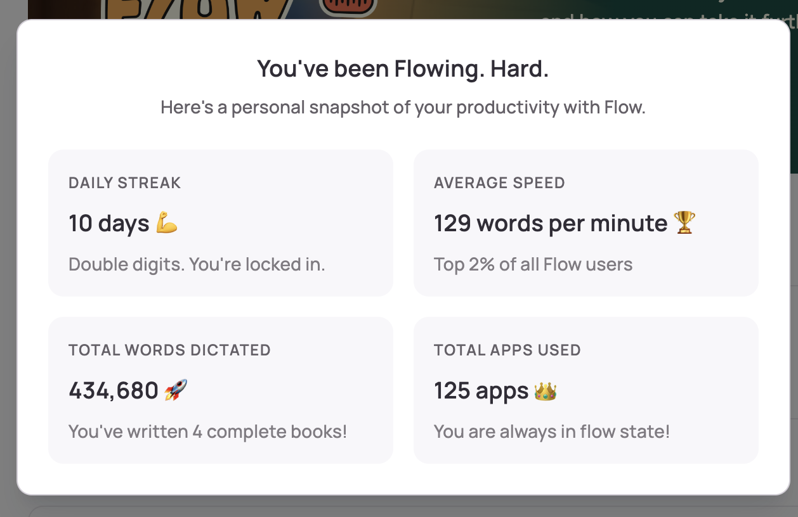

# Sync Agents 102

Commands, Skills & Tools

<!--
Welcome to Sync Agents 102. This is day 2, morning session.

In 101 you learned the fundamentals: taking meeting notes, asking questions, creating plans. Today we codify those patterns into reusable commands and skills.

We start with the foundation: testing infrastructure that enables agents to self-correct. Then we cover AGENTS.md for always-on context, planning patterns, codifying workflows into commands and skills, and finally external tools and advanced verification.

The key message: these capabilities exist for when you need them. Don't overthink it upfront. As you use AI more, make mistakes, and repeat yourself - that's when you reach for these tools. But start with good tests and infrastructure - that's the real foundation.
-->

---

# What We'll Cover

1. **Foundation:** Testing infrastructure, AGENTS.md, and file organization
2. **Planning & Context:** How to work effectively with agents
3. **Codification:** Custom commands, skills, and toolkits
4. **Tools & Verification:** External tools and advanced verification patterns

<!--
Four parts today.

Foundation covers testing infrastructure that enables self-correction, AGENTS.md files for always-on context, and file organization for AI navigation.

Planning and Context is about how to work effectively with agents - planning patterns, loading context, and using sub-agents.

Codification is about turning repeated behaviors into reusable commands and skills.

Tools and Verification covers external tool integrations like MCP servers, and advanced verification patterns like prompt optimization and autonomous debugging.

The real benefits come from good tests and infrastructure. Everything else builds on that foundation.
-->

---

# What You Learned in Sync 101

**The fundamentals of synchronous agent workflows:**

- Capturing meeting notes (Granola, Wispr Flow)
- Feeding notes to agents to extract context
- Asking clarifying questions to refine understanding
- Turning results into structured plan.md files

**Today:** We codify these patterns into reusable commands and skills.

<!--
Quick recap of 101.

You learned to capture meeting notes with tools like Granola or Wispr Flow. Feed those notes to agents to extract context. Ask clarifying questions. Turn the results into structured plan files.

That was about live coding and effective prompting. Today we make those patterns repeatable and scalable.
-->

---
layout: section
---

## What stuck out most from 101? (one phrase is fine)

---
layout: section
---

# Part 1: Foundation

Infrastructure, AGENTS.md, and File Organization

<!--
Part 1 is about foundation. We start with testing infrastructure that enables self-correction, then cover AGENTS.md files for always-on context, and file organization for AI navigation.
-->

---

# Self-Correction Through Infrastructure

When agents can verify their work, they can run longer and more reliably.

<AgentView query="Add input validation to the signup form" :events="[{ type: 'status', content: 'Implementing validation logic...' }, { type: 'files-edited', editedCount: 1 }, { type: 'tool-call', title: 'bash', content: 'git commit -m feat: add signup validation' }, { type: 'tool-result', content: 'pre-commit hook failed: ruff check: F401 re imported but unused', isError: true }, { type: 'status', content: 'Fixing pre-commit failures...' }, { type: 'files-edited', editedCount: 1 }, { type: 'tool-call', title: 'bash', content: 'git commit -m feat: add signup validation' }, { type: 'tool-result', content: 'pre-commit hook passed - [feature/validation 3a2b1c0]' }, { type: 'assistant', content: 'Validation added and committed. Pre-commit caught an unused import - fixed.' }]" :height="380" />

<!--
Infrastructure is the real foundation.

When agents can verify their own work, they can run for much longer with high reliability. Type systems, linters, formatters, and tests give agents tools to check their output.

The self-healing loop: agent writes code, runs linter or tests, reads errors, fixes issues, runs again. This continues until all checks pass.

An agent might iterate dozens of times on a single task. The tools provide feedback that lets agents see their own mistakes and fix them.
-->

---

# Tools That Enable Self-Healing

- **Linting:** ESLint, Ruff, Prettier catch errors and style issues
- **Type systems:** TypeScript, mypy catch type errors
- **Formatters:** Consistent code style agents can follow
- **Tests:** Verify behavior matches expectations
- **Pre-commit hooks:** Block commits until checks pass

All the things engineers have complained about are now essential for agent self-healing.

<!--
What enables self-healing?

Linting catches errors and style issues. Type systems catch type errors before runtime. Formatters ensure consistent style. Tests verify behavior.

Pre-commit hooks block commits until checks pass - agents can't push a PR unless tests pass.

All the things engineers have complained about - types, linters, formatters, tests - are now essential for agent self-healing. They're not just for humans anymore.
-->

---

# Git Hooks: Pre-commit vs Pre-push

**Two checkpoints for catching issues:**

| Hook | When | What to Run |
|------|------|-------------|
| **Pre-commit** | Before each commit | Fast checks: formatting, linting |
| **Pre-push** | Before pushing | Slower checks: type checking, fast tests |

Agents can't push unless all checks pass. Humans can bypass with `--no-verify`.

<Callout type="tip">
Not sure how to get started? Ask your coding agent: "Audit what pre-commit setup can be done and install it for me" - it will set everything up.
</Callout>

<!--
Understanding the different Git hooks helps you structure your checks.

Pre-commit runs before each commit. Use it for fast checks - formatting and linting. These should complete in seconds.

Pre-push runs before pushing to remote. This is where you put slower checks - type checking and fast tests. These can take 30 seconds to a minute.

Agents can't push a PR unless all checks pass. Human developers can still push with --no-verify when they need to, but agents follow the rules.
-->

---

# Fast CI: Split Fast vs Slow Tests

Code is cheap now. Slow feedback loops kill velocity.

**Split your tests:**

| Test Type | Duration | When to Run |
|-----------|----------|-------------|
| **Fast** | < 2 min | Every push (pre-push hook) |
| **Slow** | > 2 min | PR creation, nightly, or manually |

**Rule:** Pre-push hooks run fast tests only. Save slow tests for CI.

<Callout type="tip">
Ask your agent: "Audit our tests and mark them as fast or slow, then set up pre-commit to run fast tests and CI to run slow tests"
</Callout>

*If your test suite takes 40 minutes, that's a separate problem to solve.*

<!--
Fast CI is essential. If your test suite takes 40 minutes, that's a separate problem you need to solve.

Code is cheap now. Agents can write code quickly. But if every change takes 40 minutes to verify, you've bottlenecked on feedback loops.

Split your tests. Fast tests - unit tests, smoke tests - should run in under 2 minutes. Run these on every push. Slow tests - integration tests, E2E tests - run these on PR creation, nightly, or manually.

Pre-push hooks should only run fast tests. Save the slow tests for CI where they can run in parallel with your work.
-->

---

# Test-Driven Development with Agents

**Tests give agents a clear target to iterate against.**

1. Write tests based on expected input/output pairs
   - Be explicit that you're doing TDD (avoid mock implementations)
2. Run tests and confirm they fail
   - Explicitly say not to write implementation code yet
3. Commit the tests when satisfied
4. Write code that passes the tests
   - Tell the agent not to modify the tests
   - Let it iterate until all tests pass
5. Commit the implementation

**Why this works:** Agents perform best with verifiable goals. Tests provide the feedback loop.

<!--
TDD works exceptionally well with agents.

Step 1: write tests based on expected behavior. Be explicit you're doing TDD so the agent doesn't create mock implementations for functionality that doesn't exist yet.

Step 2: run the tests and confirm they fail. Tell the agent not to write implementation code at this stage.

Step 3: commit the tests once you're satisfied with the coverage.

Step 4: write the implementation. Tell the agent not to modify the tests, and let it iterate until all tests pass.

Step 5: commit once you're satisfied.

The key insight: agents perform best with clear targets to iterate against. Tests provide that feedback loop - the agent makes changes, runs tests, sees failures, fixes them, and continues until everything passes.
-->

---

# Audit Your Setup: Four Prompts

Run these prompts one at a time. Copy-paste into Cursor:

1. **Pre-commit hooks:**

   ```
   Check if we have pre-commit hooks. If not, set up pre-commit with ruff format and ruff check.
   ```

2. **Testing infrastructure/preferences:**

   ```
   Audit our testing infrastructure. What percentage of our codebase has test coverage? Which areas are untested? What testing frameworks do we use? What are our conventions for test structure and naming?
   ```

3. **Test speed:**

   ```
   Look at our CI pipeline. How long does it take? Which tests are slowest? How could we split fast vs slow tests?
   ```

4. **AGENTS.md:**

   ```
   Review our AGENTS.md file. What's missing? What patterns do we follow that aren't documented?
   ```

<!--
Here are prompts you can give Cursor to audit your setup.

First, audit your testing infrastructure. Ask what percentage has coverage, which areas are untested.

Second, look at your CI pipeline. How long does it take? Which tests are slowest? How could you split them?

Third, check if you have pre-commit hooks. If not, have the agent set them up.

Fourth, review your AGENTS.md file - or create one if it doesn't exist. What patterns do you follow that aren't documented?

These prompts give you a starting point. The agent will read your codebase and give you specific recommendations.
-->

---

# Browser Control for Visual Debugging

**Cursor's browser control enables visual debugging:**

- Embedded browser for visual debugging and design iteration
- Screenshot capture to verify UI changes
- DOM interaction - click buttons, fill forms
- Console access for reading logs and errors
- Visual verification - compare before/after screenshots

**Workflow:** Code changes, agent opens browser, takes screenshot, verifies fix matches requirements.

<!--
Browser control in Cursor enables visual debugging.

You get an embedded browser for visual debugging and design iteration. Agents can take screenshots, interact with DOM elements - clicking buttons, filling forms. They can read console logs and errors.

The workflow: make code changes, agent opens browser and navigates to your dev server, takes a screenshot, makes adjustments based on visual feedback, takes another screenshot and compares with the original, verifies the fix matches requirements.

Browser control pairs well with the toolkit philosophy. Build admin pop-ups, debug panels, feature flag toggles - then immediately test them visually.
-->

---

# AGENTS.md Files: Always-On Context

Configuration files that provide always-on context to AI agents.

- **Always-on context:** Rules loaded into every agent chat automatically
- **Minimal by design:** Start with nothing, add only when needed
- **Living documentation:** Updated when agents make mistakes
- **Tool-agnostic:** Most tools support `agents.md` or `AGENTS.md`

<!--
AGENTS.md files are configuration files that guide how agents behave in your codebase.

They're always-on - rules get loaded into every conversation automatically.

They should be minimal. Start with nothing. Only add rules when the model consistently makes wrong choices.

They're living documentation - you update them whenever agents make mistakes.

Most tools now support this naming convention.
-->

---

# Start Minimal: Add Rules When Needed

**Don't create AGENTS.md upfront.** Add instructions only when needed.

**When to add rules:**
- Model fails 2-3 times on the same issue
- Team identifies repeated patterns that need standardization
- Tool preferences need documenting (pnpm vs npm, etc.)

**What to document:**
- Tool preferences (pnpm vs npm, uv vs pip)
- Test behavior (watch vs non-watch mode)
- Style guidelines specific to your codebase
- Common patterns the model gets wrong

**Tell it why, not just what:** "Use TypeScript strict mode because we've had production bugs" is better than just "Use TypeScript strict mode."

<!--
The philosophy is start minimal.

Don't create AGENTS.md upfront. Add rules only when the model consistently makes wrong choices. If it fails 2-3 times on the same issue, that's when you add a rule.

Document tool preferences - pnpm vs npm, uv vs pip. Test behavior. Style guidelines specific to your codebase. Patterns the model gets wrong.

Important: tell it why, not just what. "Use TypeScript strict mode because we've had production bugs from implicit any types" is better than just "Use TypeScript strict mode." The why gives agents context for making judgment calls you didn't anticipate.

Avoid thousand-line templates copied from the internet. Avoid rules for things that already work correctly.
-->

---

# Directory-Specific Rules for Monorepos

For monorepos, use directory-specific files. Agents check the current directory first, then parents up to root.

<FileExplorer dir="coding-sync-102/example_fs/monorepo-example" :showWorkingDir="true" />

<!--
For monorepos and large codebases, use directory-specific AGENTS.md files.

Agents look for AGENTS.md in the current working directory first. If not found, they check parent directories up to the repo root.

This lets you have different rules for frontend vs backend vs docs. Each team can have their own conventions.

Keep root-level minimal - just shared tool preferences. Put specific rules in directory-specific files.
-->

---
layout: section
---

## Are you in a monorepo? If yes, what's the hardest area to work in?

---

# Update AGENTS.md During PR Reviews

**Critical Practice:** Update AGENTS.md during code reviews.

1. Review PR and notice agent made incorrect choice
2. Fix the code in the PR
3. `@AGENTS.md` and tell the agent to add a rule preventing the mistake

**This is "Compounding Engineering"** - each PR review teaches the agent, and those lessons compound over time.

<!--
This is one of the most important practices.

When reviewing PRs, look for mistakes that indicate the agent needs better instructions. Don't just fix the code - add a rule to AGENTS.md that prevents the mistake from happening again.

This is compounding engineering. Each correction prevents future mistakes. Over time, AGENTS.md becomes a comprehensive guide to your codebase patterns.

Teams that practice this see dramatic improvements over weeks and months.
-->

---

# The AI Champion Role

**Your team needs an AI champion.** This is going to be a lot of information - someone needs to own it.

The AI champion is responsible for:
- Setting up repos with AGENTS.md, pre-commit hooks, and infrastructure
- Creating new commands and managing the command library
- Ensuring consistency and maintaining quality standards
- Codifying repeated patterns into reusable commands

If that role doesn't exist, push your leadership to define it. As the team gets more skills, everyone can contribute - but someone needs to drive it.

<!--
Your team needs an AI champion. This is going to be a lot of information today, and someone needs to own the setup and maintenance.

If that role doesn't exist, your leadership really should figure out who from this class or on your team should be that person. If you're in this class, push your leadership to be that person for the company.

The AI champion sets up repos - AGENTS.md files, pre-commit hooks, infrastructure. They create and manage commands, ensure consistency, maintain quality standards.

As the entire team gets more skills, everyone can contribute. But we need an individual with a mandate to make quality-of-life improvements in the repository.
-->

---
layout: section
---

## Who usually catches quality issues on PRs? (everyone / TLs / a few reviewers / unclear)

---


# File Organization for AI Navigation

**Pro tip:** Create two side-by-side directories:

```text
repo/
  modular/              # Services in subdirectories (easier for AI)
    services/
      auth/
        service.ts
        types.ts
      payment/
        service.ts
        types.ts
  
  non-modular/          # Different organization
    auth-service.ts
    payment-service.ts
    auth-types.ts
    payment-types.ts
```

Code duplication is more acceptable when AI manages the overhead.

<!--
File organization matters for AI navigation.

Use unique project codenames that don't appear elsewhere in the codebase. This enables effective ripgrep usage for fast navigation.

Multiple example folders allow parallel work without conflicts. You can kick off 3 tasks to update different folders simultaneously without git conflicts.

Use pnpm workspaces with separate package.json files per project to prevent dependency issues.

Code duplication is more acceptable when AI manages the overhead.
-->

---
layout: section
---

# Part 2: Planning & Context

How to Work Effectively with Agents

<!--
Part 2 covers planning and context. How to plan effectively, load context, and work with agents before codifying patterns.
-->

---

# Plan Mode Basics

**Press Shift+Tab to toggle Plan Mode.** Instead of immediately writing code, the agent will:

1. **Research** your codebase to find relevant files
2. **Ask clarifying questions** about your requirements
3. **Create a detailed plan** with file paths and code references
4. **Wait for approval** before building

**Plans are editable Markdown.** Remove unnecessary steps, adjust the approach, or add context the agent missed.

<Callout type="tip">
Click "Save to workspace" to store plans in `.cursor/plans/`. This creates documentation, makes it easy to resume interrupted work, and provides context for future agents.
</Callout>

**Not every task needs a plan.** For quick changes or tasks you've done many times, jumping straight to the agent is fine.

**When to start over:** Sometimes fixing an in-progress agent is slower than starting fresh.

When the agent builds something that doesn't match what you wanted:

1. **Revert the changes** - don't try to fix through follow-up prompts
2. **Refine the plan** - be more specific about what you need
3. **Run it again** - let the agent rebuild from scratch

**Why this works:**
- Cleaner results than incremental fixes
- Often faster than debugging a wrong approach
- Plan refinement improves future runs too

<Callout type="tip">
If you find yourself writing long follow-up prompts to fix direction, that's a sign to start over with a better plan.
</Callout>

<!--
Plan Mode is one of the most impactful features for complex tasks.

Press Shift+Tab in the agent input to toggle it on. Instead of immediately writing code, the agent researches your codebase, asks clarifying questions about your requirements, creates a detailed implementation plan with file paths and code references, and waits for your approval before building.

Plans open as Markdown files you can edit directly. Remove unnecessary steps, adjust the approach, add context the agent missed. You're in control of what gets built.

Click "Save to workspace" to store plans in .cursor/plans/. This creates documentation for your team, makes it easy to resume interrupted work, and provides context for future agents working on the same feature.

Not every task needs a detailed plan. For quick changes or tasks you've done many times before, jumping straight to the agent is fine. Use Plan Mode for complex features, architectural changes, or when you need to think through the approach first.
-->

---

# Planning Becomes Primary Work

**As coding automates, planning becomes the bottleneck.**

The recommended cycle:

1. **Synchronous planning:** Use IDE tools to understand codebase, ask questions, create specs
2. **Asynchronous coding:** Delegate implementation to agents
3. **Synchronous testing:** Test and refine agent's changes
4. **Continuous cycle:** While one agent codes, you're planning next task

<!--
Planning is now half the work.

As coding automates, planning and testing become the primary bottlenecks.

The recommended cycle: synchronous planning using fast IDE tools, then delegate implementation to agents running async, then synchronous testing to refine their work, and repeat.

While one agent codes, you're planning the next task and testing completed work. It's a continuous cycle.
-->

---

# File-Based Planning for Large Features

For larger features, use the file system:

```markdown
Make plans in `.plans/{feature-name}/plan.md` with:
- Phases with clear feature branch names
- Files to reference
- Steps and decision log
- Components and interfaces

As you work, add notes to `.plans/{feature-name}/learnings.md` documenting:
- Progress and decisions
- Issues encountered
- Context to pick up where you left off
```

Plans can be 500-1000 lines. If implementation is wrong, delete code, iterate on plan, rebuild.

*This snippet is in some of my AGENTS.md files. You can add `.plans/` to `.gitignore` if you prefer to keep plans local - but you may need to update agent configs to read ignored files.*

<!--
While Cursor and Codex have plan modes for small features, for larger features I prefer using the file system.

Create plans in a .plans directory with structured markdown. Include phases, branch names, files to reference, steps, decision log.

As you work, add learnings to a separate file documenting progress, decisions, issues, and context for picking up later.

Plans can be 500 or even 1000 lines long. More interestingly, if the implementation is wrong, just delete the code, iterate on the plan, and rebuild it.
-->

---
layout: two-cols
---

# Voice-Driven Planning: 3x Faster

**Talking is 3x faster than typing and gives richer context.**

Instead of typing terse prompts, just talk through your thinking in detail while exploring the codebase.

Use Wispr Flow: wisprflow.ai/r?JASON50 (free month for you, and me)

::right::

<div class="flex items-center justify-center h-full">
  
</div>

<!--
Voice-driven planning is a game changer.

Use Wispr Flow or similar tools to dictate your thoughts while exploring the codebase. Talking is roughly 3x faster than typing and produces much richer context.

Instead of typing terse prompts, talk through your thinking in detail. Ask questions to guide discovery: what files are relevant, what implementation options exist, what are the trade-offs, what edge cases should I consider.

Use https://wisprflow.ai/r?JASON50 for a free month (and I get one too).
-->

---

# Prompt Evolution: Shorter + Visual

**As models improve and you build trust, prompts get shorter.**

| Stage | Prompt Style |
|-------|--------------|
| **Early** | Long, elaborate prompts explaining everything |
| **Later** | Short prompts with images - "fix padding", "redesign this" |

**The pattern:** Show the model what's wrong instead of explaining it.

<!--
Prompt evolution is something you'll experience naturally.

Early on, you write long elaborate prompts explaining everything. As you build trust and models improve, prompts get shorter.

For UI work especially, images are powerful. Just drag in a clipped screenshot of a component. A few words describe what's wrong. The model sees the visual context and fixes it.

Show the model what's wrong instead of explaining it. Visual context often works better than verbose descriptions.
-->

---

# Manage Context Windows

**Context degrades before you hit the limit.** At 20-40% usage, quality starts to drop.

**Signs you need to clear:**
- Agent keeps making the same mistake despite corrections
- Conversation has irrelevant context from earlier tasks
- Agent seems confused or contradictory

**Don't copy-paste context back in.** Instead:
- Tell the agent: "Read the plan file and tell me what's done and what's next"
- Tell the agent: "Look at git history to understand the current state"

<!--
Context windows have limits, but quality degrades before you hit them. At around 20-40% context usage, output quality starts to chip away.

If you've experienced an agent giving poor output even after compacting, that's why - the model was already degraded.

Signs you need to clear: agent keeps making the same mistake, conversation has irrelevant context, agent seems confused.

Instead of copy-pasting context back in, re-reference the plan file and use git history. The plan file shows what's done and what's next. Git history shows the actual state of the codebase. This is more reliable than trying to manually reconstruct context.
-->

---

# When to Start a New Conversation

**One of the most common questions: continue or start fresh?**

**Start a new conversation when:**
- You're moving to a different task or feature
- The agent seems confused or keeps making the same mistakes
- You've finished one logical unit of work

**Continue the conversation when:**
- You're iterating on the same feature
- The agent needs context from earlier in the discussion
- You're debugging something it just built

<Callout type="warning">
Long conversations cause agents to lose focus. After many turns and summarizations, context accumulates noise. If effectiveness is decreasing, start fresh.
</Callout>

<!--
This is one of the most common questions developers ask about agent workflows.

Start a new conversation when you're moving to a different task, when the agent seems confused or keeps making the same mistakes despite corrections, or when you've finished one logical unit of work.

Continue the conversation when you're iterating on the same feature, when the agent needs context from earlier in the discussion, or when you're debugging something it just built.

The key insight: long conversations cause agents to lose focus. After many turns and summarizations, the context accumulates noise. The agent can get distracted or switch to unrelated tasks. If you notice effectiveness decreasing, it's time to start a new conversation.

The next slide covers how to reference past work when you do start fresh.
-->

**Then load context fast using built-in features:**

**@Branch** - Reference your current work:
- "Review the changes on this branch"
- "What am I working on?"
- Agent sees all commits since diverging from main

**@Past Chats** - Reference previous conversations:
- More efficient than copy-pasting entire conversations
- Agent selectively reads from chat history
- Pulls only the context it needs

**When to use:**
- Starting a new conversation but need prior context
- Resuming work after a break
- Orienting an agent to a feature you've been building

<!--
Two Cursor features that help with context management.

@Branch lets you reference your current work. Ask "review the changes on this branch" or "what am I working on?" The agent sees all commits since you diverged from main - it understands the full scope of what you're building.

@Past Chats lets you reference previous conversations without copy-pasting everything. The agent selectively reads from chat history and pulls only the context it needs. Much more efficient than duplicating entire conversations into your prompt.

Use these when starting a new conversation but needing prior context, resuming work after a break, or orienting an agent to a feature you've been working on across multiple sessions.
-->

---
layout: two-cols
---

# Load Context Through Questions

**Ask agents to explain systems to you, rather than explaining to them.**

Many coding agents prune content to avoid limits. Questions ensure the right context gets loaded.

**After clearing context:**
- Don't dump knowledge back in
- Use git/plan files:
  - "Look at what's staged"
  - "Recent commits on this branch"
  - "Read plan file - what's done and next"

::right::

**Verify understanding:**
- Correct = right context loaded
- Wrong = catch misunderstanding early
- Wrong answers = gaps in AGENTS.md

<!--
Context loading through questions is a powerful technique.

Many coding agents have context optimization steps that prune content in hopes of never hitting the context window limit. This means asking questions is especially beneficial - it ensures the right context gets loaded and prioritized, rather than relying on what the agent happened to keep after pruning.

Instead of explaining your codebase to the agent, ask the agent to explain it to you. This forces the agent to read and understand relevant code, loading that context into its window.

Example: "Explain how these UI components are built." Even if you already know the answer, this makes the agent read all relevant component files.

After clearing context, don't dump all your knowledge back in. Instead, ask the agent questions about the codebase. Use git to recover working context - ask the agent to look at what's staged, recent commits, or read the plan file to understand what's done and what's next.

Seeing the agent's answer is valuable. If correct, you know context is loaded. If wrong, you've caught a misunderstanding before it causes problems.

Wrong answers also signal gaps in AGENTS.md. Add clarifications so future sessions get it right. This connects back to compounding engineering - every wrong answer is an opportunity to improve your agent configuration.
-->

---

# Understanding Large Codebases

**Use agents to understand before making changes:**

- Ask for feature outlines to map system dependencies
- Add log statements at key logic points to follow execution
- Ask "What is this feature? What systems is it using?"
- Use new engineer onboarding questions - agents give immediate answers

**Spend time understanding features before writing code.**

<!--
Large codebases can be intimidating. Use agents to understand them.

Ask for feature outlines that map system dependencies. Have agents add log statements at key logic points to follow execution flow.

Ask questions like "What is this feature? What systems is it using?" The agent pulls all relevant files and provides a natural language outline.

New engineers can ask coding tools about the codebase instead of waiting for domain experts. Immediate, accurate answers.
-->

---

# Cross-Project References

**Reuse solutions you've already solved elsewhere.**

- "look at ../other-project and do the same for [feature]"
- "check how ../vibetunnel handles changelogs and implement that here"

Agent infers context from project structure and adapts patterns automatically.

**This is a benefit of monorepos.** If you don't have monorepos, you can mount additional workspaces in Cursor.

<!--
Cross-project references save a lot of prompting time.

When you know you've solved a problem in another project, just tell the agent to look at it. "Look at ../other-project and do the same for this feature."

The agent infers context from the project structure and adapts patterns automatically. You don't need to re-explain what you want - just point to a working example.

This is especially useful for scaffolding new projects. Point agents at similar existing projects as reference. They'll copy patterns and adapt appropriately.

Monorepos make this easy - everything is in one workspace. But Cursor also supports mounting additional workspaces, so you can reference other projects even if they're not in a monorepo.
-->

---

# Architecture Diagrams for Code Review

**Ask agents to visualize significant changes.**

For complex changes, ask the agent to generate architecture diagrams:

```text
Create a Mermaid diagram showing the data flow for our
authentication system, including OAuth providers, session
management, and token refresh.
```

**Why this helps:**
- Reveals architectural issues before code review
- Creates documentation as a byproduct
- Forces the agent to understand system relationships
- Easier to spot missing pieces or wrong dependencies

**Good for:** API changes, new services, refactors that touch multiple systems.

<!--
For significant changes, ask the agent to generate architecture diagrams.

Mermaid diagrams work well because they're text-based - the agent can generate them inline. Ask for data flow diagrams, component relationships, or sequence diagrams for complex interactions.

This helps in multiple ways. It reveals architectural issues before code review - you can see if the data flow makes sense. It creates documentation as a byproduct. It forces the agent to understand system relationships, which often surfaces gaps in its understanding.

Use this for API changes, new services, refactors that touch multiple systems - anything where visualizing the relationships helps you verify the approach is correct.
-->

---
layout: section
---

# Part 3: Codification

Custom Commands, Skills & Tools

<!--
Part 3 is about codification. Turning repeated behaviors into reusable commands and skills.
-->

---

# Custom Slash Commands

**Commands represent codified experience.**

Every time you give AI the same instructions, turn it into a command.

After three months, a well-built toolkit handles 90% of repetitive cleanup.

**The goal:** Never have the same conversation with AI twice.

<!--
Custom slash commands automate entire workflows.

The philosophy is simple: every time you give AI the same instructions, turn it into a command. Commands represent codified experience.

After three months of building commands, a well-built toolkit handles 90% of repetitive cleanup.

The goal: never have the same conversation with AI twice.
-->

---

# Core Git Commands

Commands that automate Git-related tasks:

- `/de-slop` - Remove AI artifacts (redundant comments, mock-heavy tests)
- `/gh-commit` - Group changes into logical commits (feat, test, docs, refactor, chore)
- `/gh-fix-ci` - Download CI logs and fix failures automatically
- `/gh-review-pr` - Review PRs with structured feedback
- `/gh-address-pr-comments` - Address PR feedback systematically

Available at: github.com/jxnl/dots

<!--
Here are some core commands I use for Git workflows.

de-slop removes AI artifacts - redundant comments, temp files, mock-heavy tests.

gh-commit groups changes into logical commits automatically - features first, then tests, then docs.

gh-fix-ci downloads CI logs and fixes failures - Ruff errors, test failures, type errors.

gh-review-pr reviews PRs with structured feedback.

gh-address-pr-comments addresses PR feedback systematically.

These are all available at my dots repo on GitHub. You can copy them directly.
-->

---

# Example: /gh-commit Command

```markdown
# Commit

Create small, logical commits with conventional commit messages.

## Steps

1. Safety
   git branch --show-current
   - If on `main`/`master`: stop and create a branch

2. Inspect changes
   git status --porcelain
   git diff --stat

3. Batch changes (feat|fix, then test, then docs, then refactor/chore)
   - Keep commits atomic
   - Never `git add .`

4. Stage + commit each batch
   git add path/to/file1 path/to/file2
   git commit -m "type(scope): short description"
```

<!--
Here's what a command file looks like. This is gh-commit.

It starts with a title and description. Then steps.

First, safety check - don't commit to main. Second, inspect changes. Third, batch changes by type - features first, then tests, then docs, then refactor or chore. Fourth, stage and commit each batch.

Commands are just markdown files with structured instructions. Simple but powerful.
-->

---

# Async PR Review Workflow

Combining commands for async code review:

1. **Agent creates PR:** Tell your agent to create a PR at the end of its task
2. **Review remotely:** Get GitHub notifications on phone, review and leave comments
3. **Address feedback:** Run `/gh-address-pr-comments` - fetches line-by-line comments
4. **Fix CI:** Run `/gh-fix-ci` to download logs and fix failures

Review PRs remotely, address everything when you're back at your desk.

<!--
Here's a powerful workflow combining commands.

Agent creates a PR at the end of its task. You review remotely on your phone and leave comments. When you're back at your computer, run gh-address-pr-comments - it uses the GitHub CLI to fetch comments per line and addresses them systematically. Then run gh-fix-ci to fix any test failures.

You can review and comment on PRs from anywhere. When you return, both PR comments and CI errors get addressed automatically.
-->

---

# Team-Specific Commands

Beyond Git commands, create usage-specific commands for your team:

- **Deploy patterns:** Complex deployment workflows, multi-step processes
- **Testing patterns:** Specific test suites, environment setup
- **Domain-specific workflows:** Database migrations, API validation, infrastructure

**Question:** What workflows do you have that could become commands?

Think about repetitive tasks, repeated AI conversations, cleanup steps before shipping.

<!--
Beyond Git commands, create team-specific commands.

Deploy patterns for complex deployment workflows. Testing patterns for specific test suites. Domain-specific workflows for database migrations, API validation, whatever your team does repeatedly.

Think about it: what workflows do you have at your company that could be built as custom commands?

The repetitive tasks you do every week. The conversations you keep having with AI. The cleanup steps before you ship. Those are your next commands.
-->

---

# Case Study: PlanetScale's Changelog

PlanetScale uses Cursor commands to automate changelog entries.

**Their approach:**
1. Complete a task with Cursor normally
2. At the end, ask Cursor to create a command for the process
3. Run the command a few times, tweak when needed
4. After iterations, the workflow becomes reliable

**Prompt:** "Create a new Cursor command for the process we just went through, call it /changelog"

<!--
Case study: PlanetScale's engineering team.

Each time they ship a feature, they publish a changelog entry. The format is specific, the context exists in the repo. Perfect use case for a command.

Their approach: complete a task normally, then ask Cursor to create a command for it. Run it a few times, tweak when results aren't right. After a couple iterations, it becomes reliable.

They even trigger the command from Slack - a team member messages a bot, which opens a PR automatically.
-->

---

# From Commands to Skills

**Commands codify single workflows. Skills package entire capabilities.**

When a command grows complex or needs supporting resources, it becomes a skill.

**The progression:**
1. **Commands** - Simple, repeatable workflows
2. **Skills** - Structured capabilities with resources and scripts
3. **Toolkits** - Collections of related skills and commands

<!--
Commands are great for simple workflows. But when you need more structure - supporting scripts, reference materials, assets - that's when you move to skills.

Skills are the natural evolution of commands. They package not just instructions, but entire capabilities with all the resources needed to execute them.

Toolkits are collections of related skills and commands that work together.
-->

---

# What Are Skills?

**Skills are structured packages of instructions, resources, and scripts.**

Unlike commands which are single markdown files, skills are folders containing:
- **SKILL.md** - Main instructions and workflow
- **Scripts** - Executable helpers (Python, bash, etc.)
- **References** - Documentation, examples, templates
- **Assets** - Images, configs, or other files

**Progressive disclosure:** Skills load by name/description first, then activate fully when invoked.

<!--
Skills are more structured than commands.

A skill is a folder containing multiple files. The SKILL.md file has the main instructions. But you can also include scripts - Python scripts, bash scripts, whatever helpers are needed. References for documentation or examples. Assets like images or config files.

The key feature is progressive disclosure. At startup, only the skill name and description are loaded into context. The full skill activates when you invoke it or when the agent determines it's relevant. This keeps context windows manageable.
-->

---

# Skills and Toolkits

**Skills are like commands, but more structured.**

A skill packages instructions, resources, and scripts. Skills use progressive disclosure - loaded by name/description, activated when needed.

<FileExplorer dir="coding-sync-102/skills/qr-code-generator" :showWorkingDir="true" />

<!--
Skills are similar to commands but with more structure.

A skill folder contains a SKILL.md file with instructions, plus optional scripts, references, and assets.

Skills use progressive disclosure. At startup, only the name and description are loaded. The full skill activates when you invoke it or when the agent determines it's relevant.

OpenAI maintains an official skills catalog you can install from.
-->

---

# Skill Examples

Skills package your preferences, not just tool knowledge:

- **Slidev slide generation:** Create presentation slides using Slidev with your preferred layouts, components, and styling conventions
- **Deploy system:** Standardize deployment workflows, environment configs, and rollback procedures
- **Systems access:** Access systems via SOPs and MCP servers - tools to get A/B testing results, run analytics queries, or interact with internal APIs

The agent might know these tools, but skills capture how YOU want to use them.

<!--
Skills can be simple or complex.

QR code generator creates QR codes for links. YouTube transcript extractor gets video transcripts automatically. FFmpeg video editing packages your preferences for video work.

The key insight: skills package YOUR preferences, not just tool knowledge. The agent might already know how to use ffmpeg. But there are still specific things you want to steer - your preferred formats, quality settings, workflow patterns.

Skills capture these preferences so the agent follows your way of doing things.
-->
---

# Code You'd Never Write (Part 1)

Development tools for rapid iteration

**Test data generation:**
- "Use psql, look at the database, see how threads work, make some test threads"
- Agent examines schema, creates valid data, fixes its own mistakes
- Never worth the time to write manually, but agents do it in minutes

**Throwaway utilities:**
- UI state toggles to switch between component variations
- Debug panels, feature flag toggles, configuration editors

**Admin backdoors:**
- Temporary admin endpoints to test edge cases
- Bypass authentication for local testing

<!--
AI makes "nice to have" scripts actually happen.

Test data generation - instead of writing INSERT statements manually, tell the agent to analyze your schema and generate realistic data. It'll examine relationships, create valid data, fix its own mistakes. Never worth the time to write manually, but agents do it in minutes.

Throwaway utilities - those debug panels, feature flag toggles, configuration editors you always wanted but never prioritized. Agent-generated code is cheap. Build them for rapid iteration, remove before shipping.

Admin backdoors - temporary endpoints to test edge cases, bypass auth for local testing, force specific states. The kind of code you'd never commit but is invaluable for debugging.

These are the 15-minute scripts AI can build while you're in a meeting.
-->

---

# Code You'd Never Write (Part 2)

CLI tools agents can use programmatically

**Analysis scripts as reusable tools:**
- "Find all users who signed up in the last week but haven't logged in"
- "Show me the distribution of API response times by endpoint"

**Why CLI tools matter:**
- Agents can invoke them with different parameters
- Reusable across multiple debugging sessions

**Example workflow:**
1. Agent creates `analyze-user-activity.py --days 7 --min-logins 0`
2. Uses it to verify feature impact
3. Reuses it later as a new tool in analytics skill

<!--
The key insight: don't just write one-off scripts. Write CLI tools that agents can use programmatically.

Analysis scripts - those quick queries you write in the console but never save. But when agents write them, make them proper CLI tools with arguments. "Find all users who signed up but haven't logged in" becomes a reusable tool the agent can call with different date ranges or filters.

Why this matters: agents can invoke these tools with different parameters. They become reusable across multiple debugging sessions. The agent might use the same analysis tool to verify a feature worked, then reuse it later with different parameters to debug a different issue.

Example workflow: agent creates a tool to analyze user activity. Uses it to verify a feature impact. Reuses it later with different parameters. The tool becomes part of your debugging arsenal, not just a throwaway script.

These tools become part of the agent's toolkit for verification and debugging. They're not just scripts you run once - they're tools the agent can use programmatically.
-->

---

# Scaffold Commands and Skills

The `jxnl/dots` repo includes commands to scaffold new commands and skills:

- `/new-cmd` - Create a new command with proper structure
- `/new-skill` - Create a new skill with SKILL.md template and folder structure

Use these to quickly bootstrap your own commands and skills.

<!--
The dots repo includes scaffolding commands that help you create new commands and skills quickly.

These commands set up the proper structure, templates, and folder organization so you can focus on the content rather than the setup.
-->

---

# When to Use Sub-Agents

**Sub-agents are useful when you want to contain how much context you burn.**

Use sub-agents for tasks that would bloat your main agent's context:
- Log data analysis: identify slow functions, report findings
- Complex UI debugging: process verbose debug output
- Metrics analysis: process logs to identify bottlenecks
- Verbose test logs: extract failures and errors from noisy test output
- Codebase research: explore codebase to find answers or source of something

Sub-agent runs separately, summarizes findings, then hands concise results back to main agent.

<!--
Sub-agents are useful when you want to contain context usage.

The main benefit: keep your main agent's context window focused on code while a sub-agent handles data-heavy exploration or verbose output processing.

Sub-agent runs separately, does its work, then summarizes findings in a concise format. This prevents context bloat in your main agent.
-->

---
layout: section
---

# Part 4: Tools & Verification

External Tools & Advanced Verification Patterns

<!--
Part 4 covers external tool integrations and advanced verification patterns. MCP servers for external integrations, and advanced testing and debugging approaches.
-->

---

# MCP Servers

**MCP servers connect AI agents to external tools.**

The promise: eliminate context switching by letting agents read from Linear, Notion, Figma, etc.

The reality: for most workflows, copy-pasting into Cursor works fine.

**What I've actually used:**
- **Notion** - Read and write to Notion pages
- **Linear** - Create tickets, read issues (the must-have for ticketing)
- **Browsers** - Built-in browser control in Cursor
- **Context7 Docs** - Pull up-to-date library docs into the agent

**For everything else:** Build a CLI version and move it into a skill.

For finding more: smithery.ai has 3,400+ integrations.

<!--
MCP servers connect agents to external tools.

The promise is eliminating context switching - agents read from Linear, Notion, Figma directly.

The practical reality: for most workflows, copy-pasting into Cursor works fine. Don't over-engineer.

The must-have is ticketing integration. Install the Linear MCP, tell it to make tickets. Create a custom command for making tickets that automatically assigns the right people, projects, labels, and priority.

Browsers are built-in to Cursor and Claude Code - very useful for visual debugging and testing.

Context7 is a good example of a docs-focused MCP server. It lets you "Add Docs" for a library, then "Chat with Docs" using current reference material.

For finding more MCP servers, check out Smithery - it's a marketplace with over 3,400 integrations.
-->

---

# Case Study: Agent-Driven Prompt Optimization

**Building CLI tools agents can use to verify and iterate:**

1. **Eval runner CLI** - Runs evals given a prompt
2. **SQLite storage** - Results write to local SQLite database

The agent becomes the optimization loop:
- Run eval against current prompt
- Query results from SQLite
- Analyze what's working and failing
- Iterate on the prompt
- Run eval again to verify

<!--
Case study: agent-driven prompt optimization.

I built two CLI tools: an eval runner that runs evals given a prompt, and SQLite storage for results.

The agent becomes the optimization loop. It runs an eval, reads results from SQLite, queries results by run ID or scores, analyzes what's working and failing, iterates on the prompt, and runs the eval again.

No additional code required. The agent IS the optimization loop, using the CLI tools you've provided.

This pattern works because the tools give the agent ways to test changes and see results.
-->

---

# Real API Testing Over Fixtures

**Use real-time API calls in tests, not static JSON fixtures.**

- Static fixtures become outdated
- Real API calls catch bugs mock data never exposes
- Agents can create, test, and tear down real resources

**Example:** Fly.io API client tests actually created servers, waited for boot, then tore them down.

More expensive in API costs, but catches actual integration issues.

<!--
Consider real API testing over fixtures.

Static JSON fixtures become outdated and don't reveal actual API behavior changes. Real API calls catch bugs that mock data will never expose.

Agents can handle creating, testing, and tearing down real resources.

Example: An Elixir client for Fly.io's API where tests actually created servers, waited for them to boot, then tore them down. Agents ran tests against real infrastructure, caught edge cases, and self-corrected using actual logs.

It's more expensive in API costs, but catches actual integration issues.
-->

---

# Debug Mode for Tricky Bugs

**When standard prompting struggles, Debug Mode provides a different approach.**

Instead of guessing at fixes, Debug Mode:

1. **Generates hypotheses** about what could be wrong
2. **Instruments your code** with logging statements
3. **Asks you to reproduce** the bug while collecting runtime data
4. **Analyzes actual behavior** to pinpoint the root cause
5. **Makes targeted fixes** based on evidence

**Best for:**
- Bugs you can reproduce but can't figure out
- Race conditions and timing issues
- Performance problems and memory leaks
- Regressions where something used to work

<Callout type="tip">
The more specific you are about how to reproduce the issue, the more useful instrumentation the agent adds.
</Callout>

<!--
Debug Mode is a specific Cursor feature for tricky bugs.

Instead of the agent guessing at fixes based on code inspection, it takes a more systematic approach. It generates multiple hypotheses about what could be wrong, then instruments your code with logging statements to test those hypotheses.

You reproduce the bug while the instrumentation collects runtime data. The agent then analyzes actual behavior - not just code - to pinpoint the root cause. Finally, it makes targeted fixes based on evidence.

This works best for bugs you can reproduce but can't figure out, race conditions and timing issues, performance problems, memory leaks, and regressions where something used to work.

The key to success: provide detailed context about how to reproduce the issue. The more specific you are, the more useful the instrumentation.
-->

# Autonomous Debugging

**Tell agents what you want fixed, not how to fix it.**

Let them figure out their own approach:
- They'll write bash scripts for testing
- Create and clear log files before each run
- Set appropriate environment variables
- Write output to structured log files

**Cursor has a debug mode** that adds print commands, runs code, and debugs this way.

**Trust agents to make their own debugging tools.**

Agents have seen tons of code patterns most developers haven't.

<!--
Autonomous debugging means telling agents what you want fixed, not how to fix it.

Let them figure out their own testing and logging approach. They'll make their own helper tools - bash scripts, log files, test configs.

One example: an agent asked to debug a Node project autonomously wrote a bash script for testing, created and cleared log files before each run, set environment variables appropriately, used Node instead of Bun when needed, and wrote output to structured log files.

Trust agents to make their own debugging tools. They've seen tons of code patterns most developers haven't.
-->

---
layout: section
---

# Key Takeaways

<!--
Let's wrap up with the key takeaways from today.
-->

---

# The Core Message

**These capabilities exist for when you need them.**

Don't overthink it upfront. As you use AI more:

- You'll make mistakes - add rules to AGENTS.md
- You'll repeat yourself - turn it into a command
- You'll see patterns - codify them into skills

**The real benefits come from good tests and infrastructure.**

Everything else builds on that foundation.

<!--
The core message for today.

These capabilities exist for when you need them. Don't overthink it upfront.

As you use AI more, you'll naturally reach for these tools. You'll make mistakes - that's when you add rules to AGENTS.md. You'll repeat yourself - that's when you turn it into a command. You'll see patterns - that's when you codify them into skills.

The real benefits come from good tests and infrastructure. Everything else builds on that foundation.
-->

---

# Key Traits of Successful Agent Users

**Developers who get the most from agents share these traits:**

1. **Write specific prompts**
   - "Add tests for auth.ts covering the logout edge case, using patterns in `__tests__/`"
   - Not: "add tests for auth"

2. **Iterate on setup**
   - Add rules only after repeated mistakes
   - Add commands only after figuring out workflows

3. **Review carefully**
   - AI code can look right while being subtly wrong
   - The faster agents work, the more important review becomes

4. **Provide verifiable goals**
   - Use typed languages, configure linters, write tests
   - Give agents clear signals for correctness

5. **Treat agents as collaborators**
   - Ask for plans, request explanations, push back on approaches

<!--
These traits show up consistently in developers who get the most from agents.

First, they write specific prompts. Compare "add tests for auth.ts" with "write a test case for auth.ts covering the logout edge case, using the patterns in __tests__ and avoiding mocks." Specificity dramatically improves success rate.

Second, they iterate on their setup. They don't try to create perfect AGENTS.md files or command libraries upfront. They start simple and add rules only when they notice repeated mistakes.

Third, they review carefully. AI-generated code can look completely correct while being subtly wrong. The faster agents work, the more important your review process becomes.

Fourth, they provide verifiable goals. They use typed languages, configure linters, write tests. These give agents clear signals for whether changes are correct.

Fifth, they treat agents as capable collaborators. They ask for plans. They request explanations. They push back on approaches they don't like. The relationship is collaborative, not transactional.
-->

---

# Quick Wins to Start

**Today:**
- Check if your repo has pre-commit hooks
- How complete are your tests?

**This Week:**
- Start an AGENTS.md with one rule when model fails
- Create one custom command for something you repeat

**This Month:**
- Update AGENTS.md during PR reviews
- Build a small toolkit of 3-5 commands

<!--
Quick wins to get started.

Today: check if your repo has pre-commit hooks. How complete are your tests? That's your foundation.

This week: start an AGENTS.md file. Add one rule when the model fails. Create one custom command for something you repeat.

This month: make updating AGENTS.md part of your PR review process. Build a small toolkit of 3-5 commands.

Don't try to do everything at once. Build gradually.
-->

---

# Self-Assessment Questions

Ask yourself:

1. How complete are your tests?
2. Do you have pre-commit hooks?
3. What conversations do you keep having with AI?
4. What cleanup steps happen before every PR?
5. Who is your team's AI champion?

<!--
Self-assessment questions to think about.

How complete are your tests? Do you have pre-commit hooks? What conversations do you keep having with AI? What cleanup steps happen before every PR? Who is your team's AI champion?

These questions help you identify where to focus your effort.
-->

---
layout: section
---

## What's your biggest blocker to getting started? (tests / hooks / permissions / something else)

---

# What's Next

**This Afternoon: Async Agents 101**

- Kicking off background agents
- Linear, Slack, and GitHub integrations
- Parallel execution patterns
- Delegation philosophy

Topics covered today are prerequisites for async workflows.

<!--
This afternoon is Async Agents 101.

We'll cover kicking off background agents, integrations with Linear, Slack, and GitHub, parallel execution patterns, and delegation philosophy.

The topics we covered today - AGENTS.md, commands, testing infrastructure - are prerequisites for async workflows. Async agents need ways to verify their work, and better agent context lets you trust them with more complex tasks.
-->

---
layout: center
---

# Questions?

<div class="mt-12">

**Resources:**

<QRCode url="https://github.com/jxnl/dots" size="150" caption="Commands: github.com/jxnl/dots" />

</div>

<!--
Questions?

Resources are listed here. My dots repo has the Git commands we discussed. Smithery has MCP server integrations.
-->
