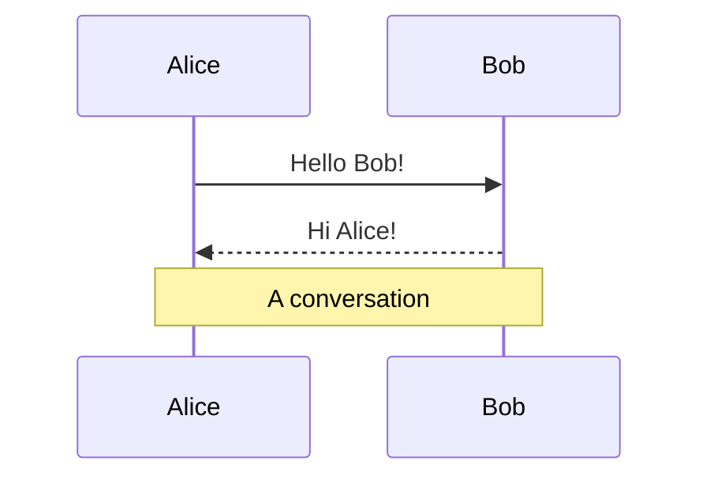
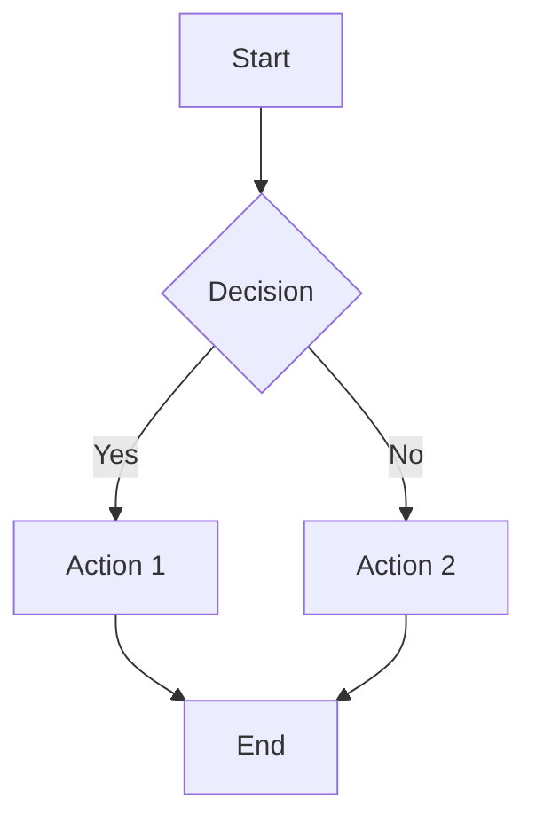
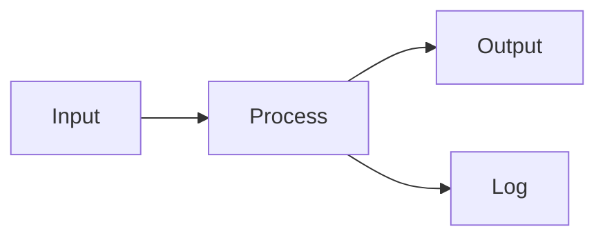
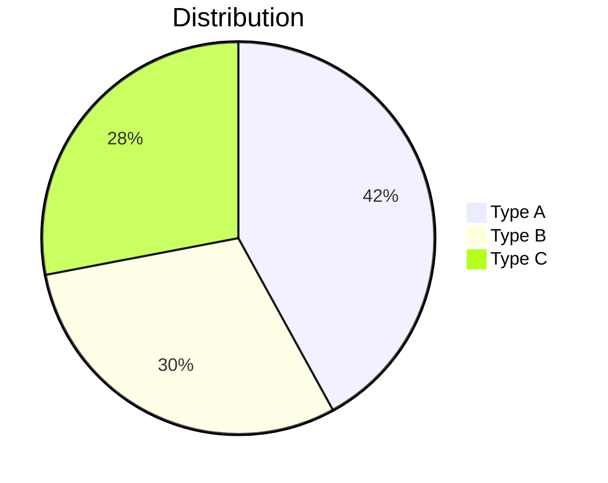

# Slidev Features Showcase

A comprehensive guide demonstrating all Slidev capabilities

<div class="mt-8">
<a href="https://twitter.com/jxnlco" target="_blank" class="inline-flex items-center gap-2 text-xl">
  <carbon:logo-twitter class="text-2xl" />
  @jxnlco
</a>
</div>

<!--
Welcome everyone! This is a comprehensive walkthrough of all the features Slidev has to offer. 

You can navigate using Space or the arrow keys - feel free to follow along and try things out as we go.
-->

---
---

# Slide Separators & Frontmatter

Slides are separated by `---` with optional frontmatter

<!-- Click 1 -->
<div v-click>

**Frontmatter Options:**

- `class:` - Apply UnoCSS classes
- `layout:` - Set slide layout (two-cols, center, image-right)
- `layoutClass:` - Additional layout styling
- `src:` - Import slides from other files
- `mdc: true` - Enable MDC syntax

</div>

<!-- Click 2 (appears with Click 1) -->
<div v-after>

**Current Slide Frontmatter:**

```yaml
---
---
```

</div>

<!--
So the first thing you need to know is how slides are structured. Each slide is separated by three dashes, and you can add frontmatter between them to control how the slide looks and behaves.

[click] Here are the main frontmatter options you'll use most often - things like applying CSS classes, setting layouts, importing other slides, and enabling special syntax features.

[click] And here's an example - this slide uses the fade-out transition, which you can see in the frontmatter at the top.
-->

---
layout: two-cols
layoutClass: gap-16
---

# Two-Column Layout

Use `layout: two-cols` in frontmatter and `::right::` marker to split content

## Left Column

Content before `::right::` appears here.

<!-- Click 1 -->
<div v-click>

- Item 1
- Item 2
- Item 3

</div>

::right::

## Right Column

Content after `::right::` appears here.

<!-- Click 2 -->
<div v-click>

```typescript
const example = {
  left: 'before ::right::',
  right: 'after ::right::'
}
```

</div>

<!--
One of the most useful layouts is the two-column layout. You set it in the frontmatter, and then use this special marker - two colons, right, two colons - to split your content.

[click] Everything before that marker goes on the left, like this list here.

[click] And everything after goes on the right side. Perfect for showing code examples alongside explanations.
-->

---
class: px-20
---

# Grid Layouts

Use UnoCSS grid syntax for flexible column layouts

<!-- Click 1 -->
<div grid="~ cols-2 gap-4" v-click>

<div class="p-4 border border-gray-300 rounded">

**Column 1**

Grid item content

</div>

<div class="p-4 border border-gray-300 rounded">

**Column 2**

Another grid item

</div>

</div>

<!-- Click 2 (appears with Click 1) -->
<div grid="~ cols-4 gap-5 pt-4" v-after>

<div class="p-2 border rounded">1</div>
<div class="p-2 border rounded">2</div>
<div class="p-2 border rounded">3</div>
<div class="p-2 border rounded">4</div>

</div>

<!--
Grid layouts are super flexible - you use UnoCSS grid syntax right in your HTML.

[click] Here's a simple two-column grid. You can see the syntax is pretty straightforward - cols-2 means two columns, gap-4 controls the spacing.

[click] And you can easily change it to four columns, or any number you want. Really handy for organizing content.
-->

---

# Icons & Images

## Carbon Icons

<!-- Click 1 -->
<div v-click>

**Component syntax:**

<div class="flex gap-4 items-center mt-2 text-2xl">

<carbon:arrow-right />
<carbon:edit />
<carbon:logo-github />

</div>

```html
<carbon:arrow-right /> <carbon:edit /> <carbon:logo-github />
```

</div>

<!-- Click 2 -->
<div v-click>

**Class syntax:**

<div class="flex gap-4 items-center mt-2">

<span class="i-carbon:arrow-up text-2xl" />
<span class="i-carbon:check text-2xl" />

</div>

```html
<span class="i-carbon:arrow-up" />
```
</div>

<!-- Click 3 -->
<div v-click>

**Button syntax:**

<button class="slidev-icon-btn" title="Action"><carbon:edit /></button>

```html
<button class="slidev-icon-btn" title="Action">
  <carbon:edit />
</button>
```

</div>

## Images

<!-- Click 4 -->
<div v-click>

<div class="flex gap-4 items-center mt-4">


</div>

</div>

<!--
Slidev comes with Carbon icons built in, and there are a few ways to use them.

[click] First, you can use them as Vue components - just write carbon colon and the icon name. Super simple.

[click] Or you can use them as CSS classes with the i-carbon prefix. This is useful when you want to style them differently.

[click] And there's a special button class for making icon buttons that look nice and have hover effects.

[click] Images work just like normal HTML - you can add borders, control size, opacity, positioning, all the usual stuff.
-->

---
layout: image-right
image: https://sli.dev/logo-square.png
---

# Image Layout

Use `layout: image-right` in frontmatter to position images

The image appears automatically on the right side.

You can also use other image layouts like `image-left` or `image` for centered images.

<!--
There's also a special image layout option. If you set layout to image-right in the frontmatter, Slidev automatically positions an image on the right side. You can also use image-left or just image for centered images. Really convenient for image-heavy slides.
-->

---

# Click Animations

## v-click

<!-- Click 1 -->
<div v-click>

This appears after the first click

</div>

<!-- Click 2 -->
<div v-click>

This appears after the second click

</div>

## v-after

<!-- Click 3 -->
<div v-click>First item</div>
<!-- Click 3 (appears with previous) -->
<div v-after>Appears with previous click</div>

## v-clicks

<!-- Clicks 4-7 (v-clicks handles 4 items) -->
<v-clicks>

- Item 1
- Item 2
- Item 3
- Item 4

</v-clicks>

## Hide After Click

<!-- Click 8 -->
<div v-click>Visible after 1 click</div>
<!-- Click 9 -->
<div v-click.hide>Hidden after 2 clicks</div>

<!--
Now let's talk about click animations - this is one of the most powerful features for presentations.

[click] The basic one is v-click - you add it to any element and it appears when you click. Perfect for revealing content step by step.

[click] Each element with v-click appears on the next click, so you can build up your content progressively.

[click] There's also v-after, which appears at the same time as the previous click. Useful when you want things to show up together.

[click] For lists, you can use the v-clicks component - it automatically animates each list item on successive clicks. Much cleaner than adding v-click to every item.

[click] Item 1 appears

[click] Item 2 appears

[click] Item 3 appears

[click] Item 4 appears

[click] And you can even hide things after clicking - just add .hide to make elements disappear. Great for replacing old content with new content.
-->

---

# v-mark (Rough Notation)

Mark and highlight elements with Rough Notation

<div class="space-y-4">

<!-- Click 1 - Mark appears -->
<div>

<span v-mark.underline="1">Underline mark (default)</span>

</div>

<!-- Click 2 - Mark appears -->
<div>

<span v-mark.circle="2">Circle mark</span>

</div>

<!-- Click 3 - Mark appears -->
<div>

<span v-mark.box="3">Box mark</span>

</div>

<!-- Click 4 - Mark appears -->
<div>

<span v-mark.highlight="4">Highlight mark</span>

</div>

<!-- Click 5 - Mark appears -->
<div>

<span v-mark.circle.orange="5">Circle with orange color</span>

</div>

<!-- Click 6 - Mark appears -->
<div>

<span v-mark="{ color: '#234' }">Custom color</span>

</div>

</div>

<!--
Rough Notation is built right in - it lets you mark and highlight elements with hand-drawn style annotations.

[click] The default is underline, which is great for emphasizing text.

[click] You can also use circle to draw a circle around something.

[click] Box draws a rectangle around the element.

[click] Highlight gives you that yellow highlighter effect.

[click] And you can customize the colors - here's an orange circle.

[click] Or use any custom color you want. Really makes things pop and draws attention to what you're talking about.
-->

---

# Motion Animations

Motion animations powered by @vueuse/motion

<div
  v-motion
  :initial="{ x: -80, opacity: 0 }"
  :enter="{ x: 0, opacity: 1 }"
  class="text-4xl font-bold"
>

Slidev Motion

</div>

<div
  v-motion
  :initial="{ x: 80, opacity: 0 }"
  :enter="{ x: 0, opacity: 1, transition: { delay: 500 } }"
  class="mt-4"
>

Animated with delay

</div>

<div
  v-motion
  :initial="{ scale: 0.5, opacity: 0 }"
  :enter="{ 
    scale: 1, 
    opacity: 1, 
    transition: { 
      delay: 1000,
      type: 'spring',
      damping: 10,
      stiffness: 20
    } 
  }"
  class="mt-4 text-2xl"
>

Spring animation

</div>

<!--
Motion animations are powered by VueUse Motion, and they're really smooth. You can animate elements sliding in, fading, scaling - all kinds of effects.

Watch this - the text slides in from the left and fades in at the same time. Then the next one comes from the right with a delay. And the last one uses a spring animation, which gives it that nice bouncy feel.

You control everything with initial and enter properties, and you can add delays, customize transitions, use spring physics - it's really powerful for making engaging presentations.
-->

---

# Code Snippets & Line Highlighting

## Basic Code Block

```typescript
function greet(name: string) {
  return `Hello, ${name}!`
}
```

## Line Highlighting

```typescript {2,3}
function add(
  a: number,
  b: number
) {
  return a + b
}
```

## Dynamic Line Highlighting

```typescript {2-3|5|all}
function process(
  input: string,
  options: Config
) {
  const result = transform(input)
  return result
}
```

<!--
Code blocks work just like you'd expect - syntax highlighting, all that good stuff.

But here's where it gets cool - you can highlight specific lines by adding line numbers in curly braces. See the second code block? Lines 2 and 3 are highlighted.

And you can do dynamic highlighting - show different lines on different clicks. The third code block demonstrates this - it highlights lines 2-3 first, then line 5, then all lines. This is perfect for walking through code step by step, highlighting what you're talking about at each stage.
-->

---

# Code Snippets with Regions

External code snippets using regions

Create snippets with `// #region snippet` and `// #endregion snippet`

Import with: `<<< ../../snippets/external.ts#snippet`

<<< ../../snippets/external.ts#snippet

<!--
You can also import code snippets from external files. This is really useful when you want to show real code from your project.

You mark a region in your code file with region and endregion comments, then import it with this special syntax. The code stays in sync with your actual files, so if you update the code, the slide updates too. Super handy for code reviews or documentation.
-->

---

# Monaco Editor

## Basic Monaco Editor

Add `{monaco}` to make code editable:

```ts {monaco}
const message = 'Hello, Slidev!'
console.log(message)
```

## Monaco Diff Editor

Use `{monaco-diff}` with `~~~` separator:

```ts {monaco-diff}
const oldCode = 'original'
const result = oldCode + ' value'

~~~

const newCode = 'updated'
const result = newCode + ' value'
```

<!--
Monaco Editor - that's the same editor that powers VS Code - is built right into Slidev.

Just add monaco to your code block and it becomes fully editable. You can type, get autocomplete, all that good stuff. Great for live coding demos. Try editing the code in the first example!

There's also a diff editor mode - use monaco-diff and separate the old and new code with three tildes. Perfect for showing before and after, or explaining what changed. The second example shows this in action.
-->

---

# Monaco Run

Execute code directly in slides with `{monaco-run}`:

```ts {monaco-run}
import { version } from 'vue'
import { emptyArray, sayHello } from './external'

sayHello()
console.log(`Vue version: ${version}`)
console.log(emptyArray<number>(10).reduce(
  (fib, _, i) => i < 2 ? [...fib, 1] : [...fib, fib[i-1] + fib[i-2]], 
  []
))
```

Check the console output!

<!--
And here's the really cool one - monaco-run. This actually executes the code right in the slide. You can import modules, run functions, see console output - it's like a mini code playground.

Check your browser console - you should see the output from this code running. This is amazing for interactive demos where you want to show code actually working.
-->

---

# Shiki Magic Move

Animate code changes across multiple snippets

````md magic-move {lines: true}
```ts {*|2|*}
// Step 1: Reactive object
const author = reactive({
  name: 'John Doe',
  books: ['Vue 2 - Advanced Guide']
})
```

```ts {*|1-2|3-4}
// Step 2: Options API
export default {
  data() {
    return {
      author: {
        name: 'John Doe',
        books: ['Vue 2 - Advanced Guide']
      }
    }
  }
}
```

```ts
// Step 3: Composition API
export default {
  setup() {
    const author = ref({
      name: 'John Doe',
      books: ['Vue 2 - Advanced Guide']
    })
    return { author }
  }
}
```
````

<!--
Shiki Magic Move is one of my favorite features. You wrap multiple code blocks with four backticks and the magic-move keyword, and it animates the transitions between them.

Watch how the code morphs from one version to another - it tracks how lines move and change. This is perfect for showing refactoring, or how code evolves from one pattern to another. Much more engaging than just showing static before and after.
-->

---

# LaTeX Math

LaTeX is supported out-of-the-box, powered by KaTeX

## Inline Math

Inline $\sqrt{3x-1}+(1+x)^2$ and $\int_0^1 x^2 dx = \frac{1}{3}$

## Block Math

$$ {1|3|all}
\begin{aligned}
\nabla \cdot \vec{E} &= \frac{\rho}{\varepsilon_0} \\
\nabla \cdot \vec{B} &= 0 \\
\nabla \times \vec{E} &= -\frac{\partial\vec{B}}{\partial t}
\end{aligned}
$$

## More Examples

$$E = mc^2$$

$$\sum_{i=1}^{n} i = \frac{n(n+1)}{2}$$

<!--
LaTeX math support is built in, powered by KaTeX. It's really fast and renders beautifully.

You can do inline math with dollar signs, perfect for equations in the middle of sentences. See the examples above.

Block math uses double dollar signs, and you can even animate it with click markers - reveal equations step by step. Watch the Maxwell's equations - they reveal progressively with clicks.

Works with all the standard LaTeX commands - integrals, summations, matrices, whatever you need. Great for technical presentations. The examples show E=mc² and a summation formula.
-->

---

# Mermaid Diagrams

Create diagrams directly in Markdown

<div grid="~ cols-2 gap-4">





</div>

<!--
You can create diagrams directly in Markdown using Mermaid. No need for external tools or image files.

Here we have a sequence diagram showing interactions between Alice and Bob, and a flowchart showing a decision tree. You can customize the scale, theme, colors - all right in your markdown. Super convenient for architecture diagrams, flowcharts, anything visual.
-->

---

# More Mermaid Diagrams

<div grid="~ cols-2 gap-4">





</div>

<!--
Mermaid supports tons of diagram types - flowcharts, sequence diagrams, pie charts, class diagrams, state diagrams, and more.

Here's a simple flowchart and a pie chart. You can mix and match different diagram types on the same slide, scale them independently, style them however you want. Really powerful for visual explanations.
-->

---

# Components

Use Vue components directly in slides

## Counter Component

<Counter :count="5" />

<!-- Click 1 -->
<div v-click>

```html
<Counter :count="5" />
```

</div>

<!-- Click 2 (appears with Click 1) -->
<div v-after>

Components are auto-imported from the `components/` directory

</div>

<!--
You can use Vue components directly in your slides - no need to import them manually. Slidev automatically finds components in the components directory.

[click] Here's the code for this counter component - it's just a regular Vue component.

[click] The cool part is that Slidev auto-imports it. You just use it like this, and it works. You can create custom components for charts, interactive demos, anything you can build in Vue.
-->

---
layout: two-cols
---

# QR Code Component

Generate QR codes dynamically in your slides

<div class="text-center">

## Basic Usage

<div class="my-2">

<QRCode url="https://sli.dev" size="150" />

</div>

<!-- Click 1 -->
<div v-click class="text-xs">

```html
<QRCode url="https://sli.dev" size="150" />
```

</div>

</div>

::right::

<div class="text-center">

## With Caption

<div class="my-2">

<QRCode url="https://sli.dev" size="150" caption="Scan to visit Slidev documentation" />

</div>

<!-- Click 2 -->
<div v-click class="text-xs">

```html
<QRCode 
  url="https://sli.dev" 
  size="150" 
  caption="Scan to visit Slidev documentation" 
/>
```

</div>

</div>

<!-- Click 3 (appears with Click 2) -->
<div v-after>

Props: `url` (required), `size` (default 200), `caption` (optional)

</div>

<!--
QR codes are super useful for presentations - you can add them at the end of your slides so people can easily access links, resources, or follow-up materials.

[click] The basic usage is simple - just provide a URL and the component generates a QR code automatically. Perfect for call-to-action slides.

[click] You can customize the size and add a caption below the QR code. This is great for explaining what the QR code links to.

[click] The component accepts a few props - url is required, size defaults to 200 pixels, and caption is optional. QR codes are generated dynamically when the slide loads, so you don't need to pre-generate any images.
-->

---
mdc: true
---

# MDC Syntax

MDC (Markdown Components) syntax enabled with `mdc: true`

This is [red text]{style="color:red"} and [blue text]{style="color:blue"}

{width=200px lazy}

::block-component{prop="value"}

The **default** slot content

::

<!--
MDC stands for Markdown Components - it's an extension that lets you do more advanced things in markdown.

You can style inline text with custom styles, add attributes to images like lazy loading, and use block components with slots. It's optional - you enable it with mdc: true in the frontmatter - but it gives you a lot more flexibility when you need it.
-->

---

# Presenter Notes

HTML comments create presenter notes

Use `[click]` markers to sync highlighting:

<!--
Content before the first click

[click] This will be highlighted after the first click

Also highlighted after the first click

- [click] This list element will be highlighted after the second click

[click:3] Last click (skip two clicks)
-->

<!-- Click 1 -->
<div v-click>

First click content

</div>

<!-- Click 2 -->
<div v-click>

Second click content

</div>

<!-- Click 3 -->
<div v-click>

Third click content

</div>

<!--
Presenter notes are super useful. You write them as HTML comments, and they show up in presenter mode but not on the main screen.

The really cool part is the click markers - you can sync highlighting in your notes with the click animations on the slide. So as you click through the slide, your notes highlight to match what you're talking about. Really helps keep you on track.

[click] See how the notes highlight as we go through each click? First click content appears.

[click] Second click content appears.

[click] Third click content appears. Makes it easy to remember what to say at each point.
-->

---

# Slide-Specific Styles

Use `<style>` tags for slide-specific CSS

<style>
h1 {
  background-color: #2B90B6;
  background-image: linear-gradient(45deg, #4EC5D4 10%, #146b8c 20%);
  -webkit-background-clip: text;
  -webkit-text-fill-color: transparent;
}

.custom-box {
  padding: 20px;
  border: 2px solid #2B90B6;
  border-radius: 8px;
  background: linear-gradient(135deg, #667eea 0%, #764ba2 100%);
  color: white;
}
</style>

<div class="custom-box">

Styled content with custom CSS

</div>

<!--
You can add slide-specific CSS using style tags. This only affects the current slide, so you can customize individual slides without affecting the rest of your presentation.

Here I've styled the heading with a gradient effect and created a custom box with its own styling. Perfect for when you need something special for a particular slide.
-->

---
layout: center
class: text-center
---

# Thank You!

All Slidev features demonstrated

<div class="mt-8">

<carbon:logo-github class="text-4xl" />

</div>

<div class="mt-4">

[Documentation](https://sli.dev) · [GitHub](https://github.com/slidevjs/slidev)

</div>

<div class="mt-6">
<a href="https://twitter.com/jxnlco" target="_blank" class="inline-flex items-center gap-2 text-xl">
  <carbon:logo-twitter class="text-2xl" />
  @jxnlco
</a>
</div>

<!--
That's a wrap! We've covered all the major features Slidev has to offer - from basic layouts and animations to advanced code editing and diagramming.

Slidev is really powerful and flexible - you can build everything from simple presentations to complex interactive demos. Check out the documentation and GitHub repo if you want to dive deeper. Thanks for watching!
-->

